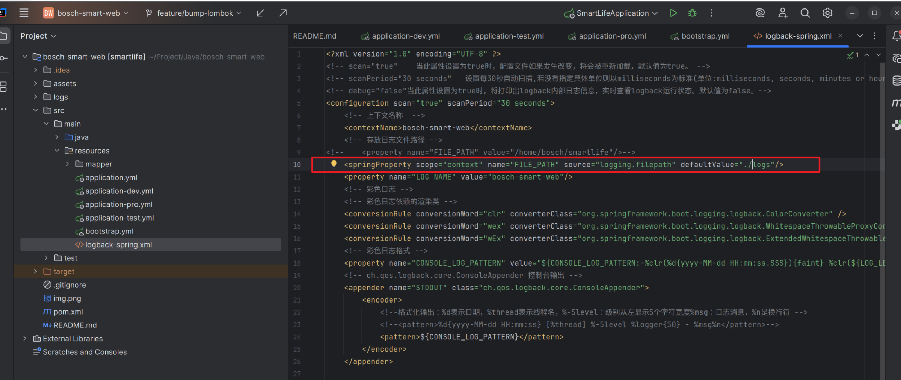
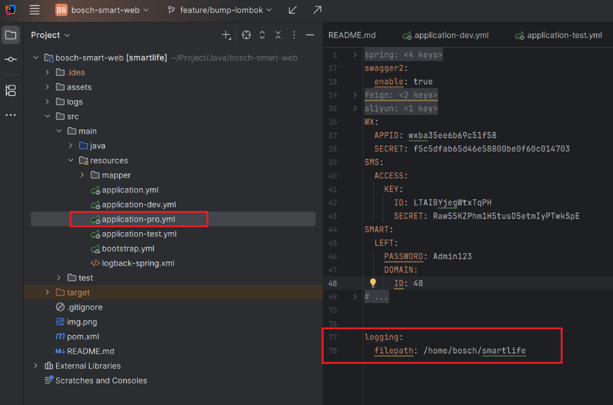
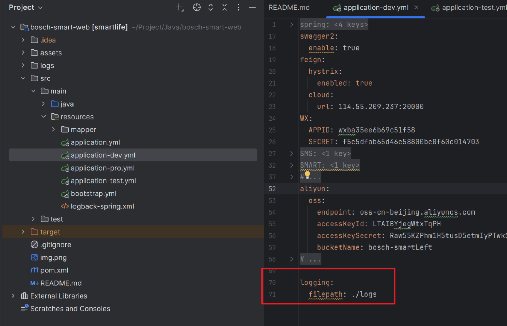

日志路径处理方式
===

# 日志存储在jar包的当前文件夹里

解决jar和非jar包运行的情况，已经不同启动路径的处理。

[CustomLogContextListener.java](common/src/main/java/hxy/dream/common/configuration/CustomLogContextListener.java)

# 日志存放在指定文件夹里

```xml

<springProperty scope="context" name="FILE_PATH" source="logging.filepath" defaultValue="./logs"/>
```



yaml 文件配置

```yaml
logging:
  filepath: /home/bosch/smartlife
```

prod



dev

