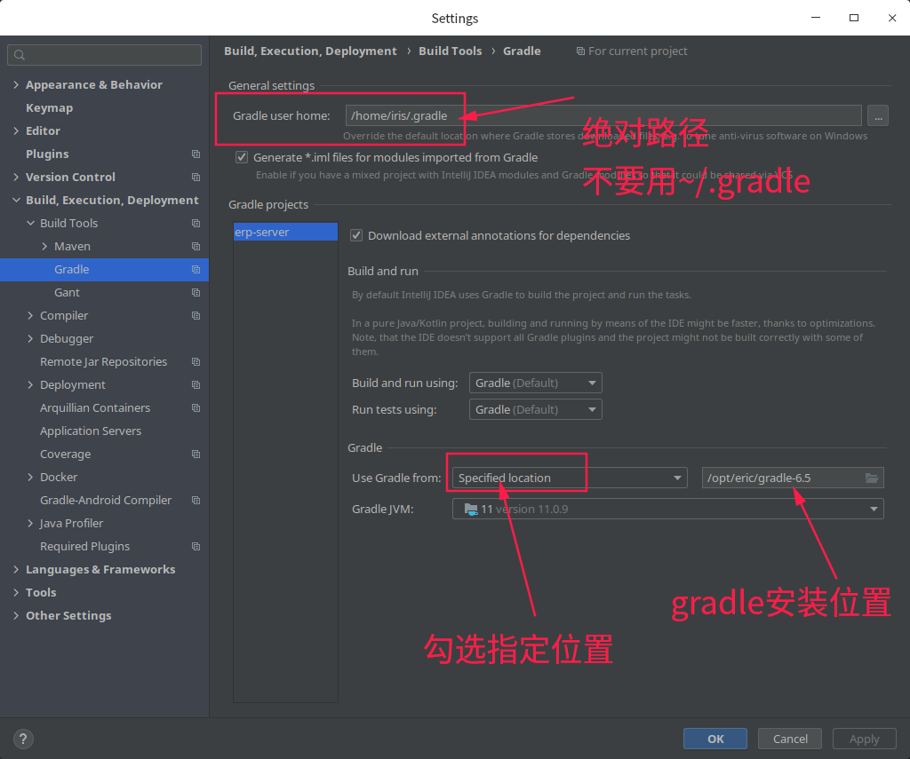
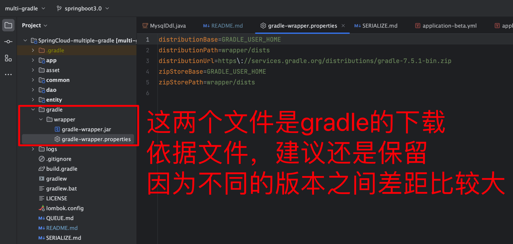
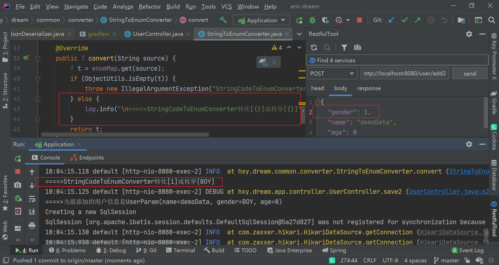
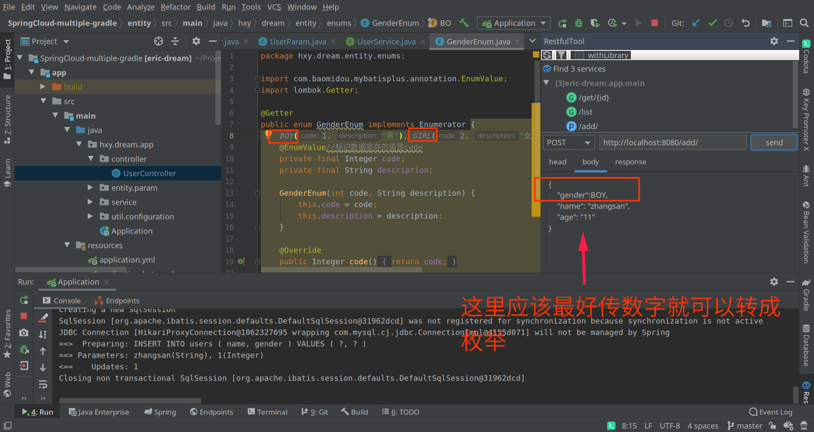
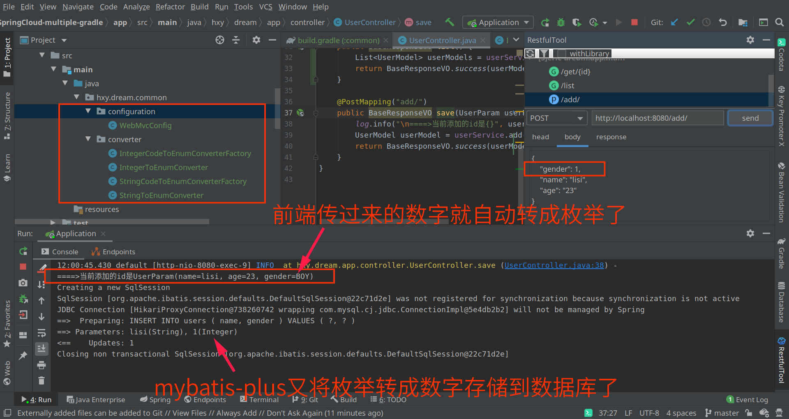
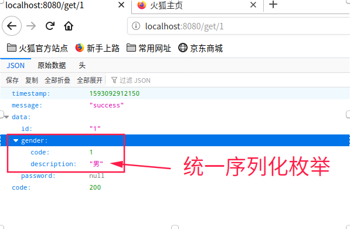

Eric-Dream
===

本项目是基于Gradle构建的多模块SpringCloud工程。采用`传统线程模型`的SpringWeb框架，mybatis-plus和mysql官方驱动。非常适合入门者学习。本项目的一大亮点就是自定义枚举序列化的处理。


具体框架如下表：


## structure

```
eric-dream
├── app --微服务注册与发现中心
├── common -- 微服务系统管理与调试
    ├── manager -- 第三方服务调用
├── entity -- 实体
├── common -- 公共，配置文件，脚手架等
└── dao -- 数据持久层
```
上面后缀server是服务治理模块。platform是业务应用模块。 **微服务=分布式开发+服务治理**

## gradle安装与配置
如果IDEA自动下载gradle很慢。那么可以先提前安装好gradle，然后指定下安装目录即可。




技术 | 说明 | 官网
----|----|----
Spring Boot | 容器+MVC框架 | [https://spring.io/projects/spring-boot](https://spring.io/projects/spring-boot)
Gradle | 项目构建工具 | [https://gradle.com/](https://gradle.com/)
Spring Security | 认证和授权框架 | [https://spring.io/projects/spring-security](https://spring.io/projects/spring-security)
MyBatis | ORM框架  | [http://www.mybatis.org/mybatis-3/zh/index.html](http://www.mybatis.org/mybatis-3/zh/index.html)
MyBatisPlus |ORM框架补充 | [https://mybatis.plus/](https://mybatis.plus/)
MyBatisGenerator | 数据层代码生成 | [http://www.mybatis.org/generator/index.html](http://www.mybatis.org/generator/index.html)
 ~~PageHelper~~ | MyBatis物理分页插件，建议使用mybatis-plus自带的分页插件 | [https://pagehelper.github.io/](https://pagehelper.github.io/)
Swagger-UI | 文档生产工具 | [https://github.com/swagger-api/swagger-ui](https://github.com/swagger-api/swagger-ui)
Hibernator-Validator | 验证框架 | [http://hibernate.org/validator/](http://hibernate.org/validator/)
Elasticsearch | 搜索引擎 | [https://github.com/elastic/elasticsearch](https://github.com/elastic/elasticsearch)
RabbitMq | 消息队列 | [https://www.rabbitmq.com/](https://www.rabbitmq.com/)
Redis | 分布式缓存 | [https://redis.io/](https://redis.io/)
redisson | 分布式锁，布隆过滤器 | https://github.com/redisson/redisson
MongoDb | NoSql数据库 | [https://www.mongodb.com/](https://www.mongodb.com/)
Docker | 应用容器引擎 | [https://www.docker.com/](https://www.docker.com/)
Hikari | SpringBoot默认数据库连接池 | [https://github.com/brettwooldridge/HikariCP](https://github.com/brettwooldridge/HikariCP)
Druid | 数据库连接池 | [https://github.com/alibaba/druid](https://github.com/alibaba/druid)
JWT | JWT登录支持 | [https://github.com/jwtk/jjwt](https://github.com/jwtk/jjwt)
LogStash | 日志收集 | [https://github.com/logstash/logstash-logback-encoder](https://github.com/logstash/logstash-logback-encoder)
Lombok | 简化对象封装工具 | [https://github.com/rzwitserloot/lombok](https://github.com/rzwitserloot/lombok)
loc |代码行数统计 | https://github.com/cgag/loc

### 命令打包，跳过TEST
```shell script
./gradlew clean bootJar -x test
```

### 多模块构建，依赖关系解决
```groovy
//    implementation的依赖是不可以传递的而，entity需要被app依赖，所以需要加上
//    implementation project(':entity') /* 子模块之间的依赖 */
    compile project(':entity') /* 子模块之间的依赖 */
```

### 版本指定，类似dependencyManager

### docker自动化跑起来
google出品的一个插件，可以直接将SpringBoot构建推送到Docker仓库
```groovy
    id "com.google.cloud.tools.jib" version "2.0.0"
```


## 统一序列化枚举

https://juejin.im/post/6844904196693557255

#### Controller层
##### 入参
###### 表单提交



###### json




> 参考：[Spring Boot 使用枚举类型作为请求参数
](https://docs.qq.com/doc/DSE54YmRuY0hlZFpY)

现在的问题在于jackson将枚举反序列化的时候需要使用code而不是ordinal。显然之前的Convert在这里貌似并没有什么作用。因为这里基本上全部靠jackson来序列化。

##### 返回
> 参考：[JSON类库Jackson优雅序列化Java枚举类
](https://docs.qq.com/doc/DSFpuQkRrdk9xUlF6)



如果发生无法正常解析的时候，那么可能是注入的bean无法使用

如果发现注入的bean无法解决json序列化问题，那么可以在`BaseEnum`加上这个注解
```java
@JsonFormat(shape = JsonFormat.Shape.OBJECT)
```

#### ORM层

> 参考 mybatis-plus:https://mp.baomidou.com/guide/enum.html

1. [自动填充字段](https://docs.qq.com/doc/DSG5Zbk9RR1FHRVZE)

#### 总结
通过上面方法，对数据库层和Controller层的转换操作，可以很好的处理枚举在应用中的形态，程序中可以很好的使用枚举了。

#### 自定义date的序列化器

https://blog.csdn.net/bandancer/article/details/84926383

[基于fastjson在mvc中解决enum类型序列化反序列化](https://zhuanlan.zhihu.com/p/121112597)


### 过滤器

[关于springboot中添加Filter的方法](https://www.jianshu.com/p/3d421fbce734)

### 

```
WARN  at com.zaxxer.hikari.pool.PoolBase.isConnectionAlive (PoolBase.java:184) - HikariPool-1 - Failed to validate connection com.mysql.cj.jdbc.ConnectionImpl@63ec6a5a (No operations allowed after connection closed.). Possibly consider using a shorter maxLifetime value.
```

### 全局异常捕获

这个可以去掉满屏的`try catch` ，还可以结合事务。

https://blog.csdn.net/qq_27127145/article/details/85775240
