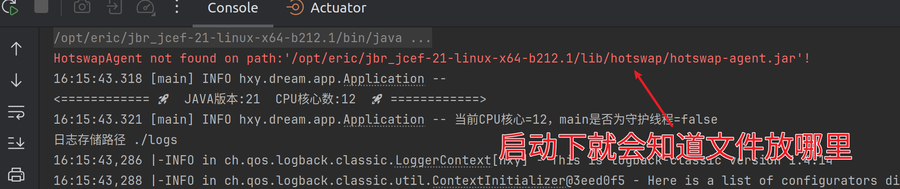

<h1 align="center" style="margin: 30px 0 30px; font-weight: bold;">Eric-Dream</h1>

本工程承担日常实验的作用，任何先行的尝试都在这里实践与落地。成熟的方案设计会在 [base-server](https://gitee.com/aohanhongzhi/springboot-base)
里面落地到生产。

本项目是基于Gradle构建的多模块SpringCloud工程。采用`传统线程模型`
的SpringWeb框架，mybatis-plus和mysql官方驱动。非常适合入门者学习。本项目的一大亮点就是[自定义枚举序列化的处理](SERIALIZE.md)。

## 主要实现功能如下

 功能                                                                                | 实现                                                                                                                                                                                                                                                                                          | 用途                                              
-----------------------------------------------------------------------------------|---------------------------------------------------------------------------------------------------------------------------------------------------------------------------------------------------------------------------------------------------------------------------------------------|-------------------------------------------------
 IDEA开发热加载实现                                                                       | JBR + HotswapAgent                                                                                                                                                                                                                                                                          | https://github.com/HotswapProjects/HotswapAgent 
 [jackson序列化](SERIALIZE.md)                                                        | 自定义序列化器 [BaseEnumSerializer.java](common%2Fsrc%2Fmain%2Fjava%2Fhxy%2Fdream%2Fcommon%2Fserializer%2FBaseEnumSerializer.java)                                                                                                                                                                 | 解决参数枚举的序列化问题                                    
 logback钉钉通知                                                                       | 自定义Appender       [LogbackDingTalkAppender.java](common%2Fsrc%2Fmain%2Fjava%2Fhxy%2Fdream%2Fcommon%2Fextend%2FLogbackDingTalkAppender.java)                                                                                                                                                 | Error消息及时通知                                     
 logback邮件通知                                                                       | 默认支持                                                                                                                                                                                                                                                                                        | Error异常及时通知                                     
 全局异常捕获                                                                            | [GlobalExceptionHandler.java](common%2Fsrc%2Fmain%2Fjava%2Fhxy%2Fdream%2Fcommon%2Fextend%2FGlobalExceptionHandler.java)                                                                                                                                                                     | 捕获异常                                            
 数据库字段加解密                                                                          | [参考CustomTypeHandler](dao/src/main/java/hxy/dream/dao/configuration/mybatis/CustomTypeHandler.java)                                                                                                                                                                                         | 给部分数据库字段加解密                                     
 执行初始化SQL语句                                                                        | [自动建表](common/src/main/java/hxy/dream/common/init/ApplicationStartupRunner.java)                                                                                                                                                                                                            |
 [MybatisPlus的SQL脚本自动维护](common/src/main/java/hxy/dream/common/init/MysqlDdl.java) | https://baomidou.com/pages/1812u1/                                                                                                                                                                                                                                                          | 自动建表                                            
 SpringBoot 3.0 声明式API远程调用                                                         | 参考 [RemoteApi](common/src/main/java/hxy/dream/common/manager/RemoteApi.java)                                                                                                                                                                                                                |
 参数全局trim()                                                                        | [StringTrimDeserializer](common/src/main/java/hxy/dream/common/serializer/StringTrimDeserializer.java)                                                                                                                                                                                      | 避免异常数据                                          
 Long类型超长转String                                                                   | [BaseLongSerializer.java](common%2Fsrc%2Fmain%2Fjava%2Fhxy%2Fdream%2Fcommon%2Fserializer%2FBaseLongSerializer.java)                                                                                                                                                                         | 解决前端无法正确显示超长String                              
 前端null传到后端成"null"字符串                                                              | [StringToStringConverter](common/src/main/java/hxy/dream/common/converter/StringToStringConverter.java)                                                                                                                                                                                     | 解决字符串"null"等问题                                  
 敏感信息从程序外配置文件读取                                                                    | [RemoteEnvironmentPostProcessor.java](common%2Fsrc%2Fmain%2Fjava%2Fhxy%2Fdream%2Fcommon%2Fconfiguration%2FRemoteEnvironmentPostProcessor.java)    极海的方案      [DataSourceConfigLoader.java](common%2Fsrc%2Fmain%2Fjava%2Fhxy%2Fdream%2Fcommon%2Fconfiguration%2FDataSourceConfigLoader.java) | 从程序外的配置文件读取数据库的账号密码信息                           
 单元测试默认配置环境                                                                        | [ @ActiveProfiles("test") ](app%2Fsrc%2Ftest%2Fjava%2Fhxy%2Fdream%2FBaseTest.java)                                                                                                                                                                                                          | 解决每次修改yaml文件的烦恼                                 | 
数据库字段加密 | [参考CustomTypeHandler](dao/src/main/java/hxy/dream/dao/configuration/mybatis/CustomTypeHandler.java)                                                                                                                                                                                         | 不支持模糊查询
# 基础理论项目研究

 基础理论 | 项目地址                                     
------|------------------------------------------
 IoC  | https://gitee.com/eric-tutorial/easy-ioc 
 RPC  | https://gitee.com/aohanhongzhi/my-rpc    

## jdk下载

https://www.azul.com/

### 热加载技术

#### IDEA2024.2

**最新版本的IDEA2024.2 已经默认支持了热加载。也是需要在debug模式下。**

#### 【废弃】第三方插件

这个针对的是[Jetbrains Runtime](https://github.com/JetBrains/JetBrainsRuntime/releases) ，所以其他JDK慎重。实际测试jdk17 21都可以正常运行。

https://github.com/HotswapProjects/HotswapAgent

```shell
-XX:+AllowEnhancedClassRedefinition -XX:HotswapAgent=fatjar
```

> JDK22 识别不了这个参数了，也不需要这个插件，就可以热加载类了




注意需要在**debug**模式下启动才能生效。

修改代码后，Build -> Rebuild Project (Ctrl + Shift + F9) 重新编译和加载修改的类文件即可生效。

## structure

```
eric-dream
├── app --微服务注册与发现中心
├── common -- 微服务系统管理与调试
    ├── manager -- 第三方服务调用
├── entity -- 实体
├── common -- 公共，配置文件，脚手架等
└── dao -- 数据持久层
```

上面后缀server是服务治理模块。platform是业务应用模块。 **微服务=分布式开发+服务治理**

具体框架如下表：

 技术                   | 说明                                                 | 官网                                                                                                           
----------------------|----------------------------------------------------|--------------------------------------------------------------------------------------------------------------
 Spring Boot          | 容器+MVC框架                                           | [https://spring.io/projects/spring-boot](https://spring.io/projects/spring-boot)                             
 Gradle               | 项目构建工具                                             | [https://gradle.com/](https://gradle.com/)                                                                   
 Spring Security      | 认证和授权框架                                            | [https://spring.io/projects/spring-security](https://spring.io/projects/spring-security)                     
 MyBatis              | ORM框架                                              | [http://www.mybatis.org/mybatis-3/zh/index.html](http://www.mybatis.org/mybatis-3/zh/index.html)             
 MyBatisPlus          | ORM框架补充                                            | [https://baomidou.com/](https://baomidou.com/)                                                               
 MyBatisGenerator     | 数据层代码生成                                            | [http://www.mybatis.org/generator/index.html](http://www.mybatis.org/generator/index.html)                   
 Swagger-UI           | 文档生产工具                                             | [https://github.com/swagger-api/swagger-ui](https://github.com/swagger-api/swagger-ui)                       
 Hibernator-Validator | 验证框架                                               | [http://hibernate.org/validator/](http://hibernate.org/validator/)                                           
 Elasticsearch        | 搜索引擎                                               | [https://github.com/elastic/elasticsearch](https://github.com/elastic/elasticsearch)                         
 RabbitMq             | 消息队列                                               | [https://www.rabbitmq.com/](https://www.rabbitmq.com/)                                                       
 Redis                | 分布式缓存                                              | [https://redis.io/](https://redis.io/)                                                                       
 redisson             | 分布式锁，布隆过滤器                                         | https://github.com/redisson/redisson                                                                         
 MongoDb              | NoSql数据库                                           | [https://www.mongodb.com/](https://www.mongodb.com/)                                                         
 Docker               | 应用容器引擎                                             | [https://www.docker.com/](https://www.docker.com/)                                                           
 Hikari               | SpringBoot默认数据库连接池                                 | [https://github.com/brettwooldridge/HikariCP](https://github.com/brettwooldridge/HikariCP)                   
 Druid                | 数据库连接池                                             | [https://github.com/alibaba/druid](https://github.com/alibaba/druid)                                         
 JWT                  | JWT登录支持                                            | [https://github.com/jwtk/jjwt](https://github.com/jwtk/jjwt)                                                 
 LogStash             | 日志收集                                               | [https://github.com/logstash/logstash-logback-encoder](https://github.com/logstash/logstash-logback-encoder) 
 Lombok               | 简化对象封装工具                                           | [https://github.com/rzwitserloot/lombok](https://github.com/rzwitserloot/lombok)                             
 loc                  | 代码行数统计                                             | https://github.com/cgag/loc                                                                                  
 ko-time              | 轻量级的springboot项目性能分析工具，通过追踪方法调用链路以及对应的运行时长快速定位性能瓶颈 | https://gitee.com/huoyo/ko-time                                                                              
 okhttps              | 强大轻量 且 前后端通用的 HTTP 客户端，同时支持 WebSocket 以及 Stomp 协议  | https://ok.zhxu.cn/                                                                                          

#### SpringBoot支持

https://spring.io/projects/spring-boot#support

## gradle安装与配置

https://github.com/GradleCN/GradleSide

如果IDEA自动下载gradle很慢。那么可以先提前安装好gradle，然后指定下安装目录即可。


腾讯的代理镜像

https://mirrors.cloud.tencent.com/gradle/gradle-7.5.1-bin.zip

https\://services.gradle.org/distributions/gradle-7.4-bin.zip


### 命令打包，跳过TEST

```shell script
./gradlew clean bootJar -x test
```

```shell
./gradlew  bootRun -x test
```

带上参数

```
./gradlew bootRun -x test --args='--spring.profiles.active=test'
```

```shell
./gradlew dependencyInsight --dependency mybatis
```

### 构建

并行构建

```shell
gradle build -x test --parallel --build-cache 
```

> 需要解决多工程的依赖分析

### gradle多模块构建，依赖关系解决

```groovy
 api project(':dao') 
```

以下是 gradle6前后的使用方式：

```groovy
//    implementation的依赖是不可以传递的而，entity需要被app依赖，所以需要加上
//    implementation project(':entity') /* 子模块之间的依赖 */
compile project(':entity') /* 子模块之间的依赖 */
```

1. [如何使用Gradle管理多模块Java项目](https://zhuanlan.zhihu.com/p/372585663)

### 版本指定，类似dependencyManager

### docker自动化跑起来

google出品的一个插件，可以直接将SpringBoot构建推送到Docker仓库

```groovy
    id "com.google.cloud.tools.jib" version "2.0.0"
```

## 统一Long类型序列化

### 方案1

[BaseLongSerializer.java](common%2Fsrc%2Fmain%2Fjava%2Fhxy%2Fdream%2Fcommon%2Fserializer%2FBaseLongSerializer.java)

### 方案2

https://mp.weixin.qq.com/s/qhG9T0VdW4VkVy2VJJmftg

```java
import org.springframework.boot.autoconfigure.jackson.Jackson2ObjectMapperBuilderCustomizer;
import org.springframework.context.annotation.Bean;
import org.springframework.context.annotation.Configuration;

import com.fasterxml.jackson.databind.ser.std.ToStringSerializer;

@Configuration
public class JacksonConfiguration {

    @Bean
    public Jackson2ObjectMapperBuilderCustomizer jackson2ObjectMapperBuilderCustomizer() {
        return builder -> {
            // 把 Long 类型序列化为 String
            builder.serializerByType(Long.class, ToStringSerializer.instance);
        };
    }
}
```

前端JS内置的number类型是基于32位整数，Number类型的最大安全整数为9007199254740991，当Java Long型的值大小超过JS
Number的最大安全整数时，超出此范围的整数值可能会被破坏，丢失精度。

解决办法就是后端将超过精度的Long和long类型转成String给前端展示即可。

> [JSON类库Jackson优雅序列化Java类](https://docs.qq.com/doc/DSFpuQkRrdk9xUlF6)

## 统一序列化枚举

https://juejin.im/post/6844904196693557255
统一序列化的核心在于重写序列化器。但是粒度就需要好好控制了，是序列化所有的枚举类，还是只处理自己写的枚举类。
本项目是只处理自己写的枚举类，其方式是让所有自己写的枚举必须实现统一的BaseEnum接口。在一些团队合作的大项目里，
可能这种规范并不会被所有人认可，所以也可以用限制包的方式，自己配置指定包的枚举可以被统一处理。

#### Controller层

##### 入参

###### 表单提交


###### json


> 参考：[Spring Boot 使用枚举类型作为请求参数
](https://docs.qq.com/doc/DSE54YmRuY0hlZFpY)

现在的问题在于jackson将枚举反序列化的时候需要使用code而不是ordinal。显然之前的Convert在这里貌似并没有什么作用。因为这里基本上全部靠jackson来序列化。

##### 返回

> 参考：[JSON类库Jackson优雅序列化Java枚举类
](https://docs.qq.com/doc/DSFpuQkRrdk9xUlF6)


如果发生无法正常解析的时候，那么可能是注入的bean无法使用

如果发现注入的bean无法解决json序列化问题，那么可以在`BaseEnum`加上这个注解

```java
@JsonFormat(shape = JsonFormat.Shape.OBJECT)
```

#### ORM层

>
参考 [mybatis-plus官网](https://baomidou.com/pages/8390a4/#%E6%AD%A5%E9%AA%A41-%E5%A3%B0%E6%98%8E%E9%80%9A%E7%94%A8%E6%9E%9A%E4%B8%BE%E5%B1%9E%E6%80%A7)

1. [自动填充字段](https://docs.qq.com/doc/DSG5Zbk9RR1FHRVZE)

#### 总结

通过上面方法，对数据库层和Controller层的转换操作，可以很好的处理枚举在应用中的形态，程序中可以很好的使用枚举了。

#### 自定义date的序列化器

https://blog.csdn.net/bandancer/article/details/84926383

[基于fastjson在mvc中解决enum类型序列化反序列化](https://zhuanlan.zhihu.com/p/121112597)

### 过滤器

[关于springboot中添加Filter的方法](https://www.jianshu.com/p/3d421fbce734)

###              

```
WARN  at com.zaxxer.hikari.pool.PoolBase.isConnectionAlive (PoolBase.java:184) - HikariPool-1 - Failed to validate connection com.mysql.cj.jdbc.ConnectionImpl@63ec6a5a (No operations allowed after connection closed.). Possibly consider using a shorter maxLifetime value.
```

### 全局异常捕获

这个可以去掉满屏的`try catch` ，还可以结合事务。

https://blog.csdn.net/qq_27127145/article/details/85775240

## 数据库字段加解密

[MybatisPlus数据库加解密](https://gitee.com/aohanhongzhi/study/blob/dev/src/SpringBoot/Mybatis-plus%E6%95%B0%E6%8D%AE%E5%BA%93%E5%AD%97%E6%AE%B5%E5%8A%A0%E8%A7%A3%E5%AF%86.md)
[参考CustomTypeHandler](dao/src/main/java/hxy/dream/dao/configuration/mybatis/CustomTypeHandler.java)

https://blog.csdn.net/YW_Danny/article/details/120031966

> https://blog.csdn.net/u012954706/article/details/105437768

# 封装类型与基础类型

1. 所有POJO类属性必须使用包装数据类型
2. 所有的局部变量使用基本数据类型。

> 来自 《阿里巴巴Java开发规范》

# TODO

- [x] 
  有的前端输入带有空格或者换行，到数据库存储可能会发生意想不到的bug,所以需要在反序列化的时候，需要将其中的非法字符去掉。需要设计一个方案做下全局的参数trim()

https://zhuanlan.zhihu.com/p/372585663
