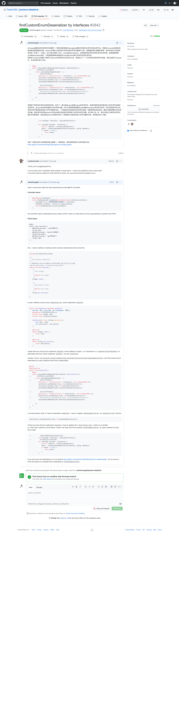

# SpringBoot+Mybatisplus中枚举正反序列化的实际应用

> 本文基于SpringBoot+Mybatisplus 框架就Java枚举的正反序列化的实际应用进行一次分析与研究，此外顺便带上DAO层关于枚举的操作，使得程序中完全使用枚举编程。由于SpringBoot内置的json处理器是jackson，所以本文的json相关处理也就是采用默认的jackson。


## 背景

N久之前，leo曾经问我枚举的应用，我清楚地记得菜鸟教程(https://www.runoob.com/)上面有这样一段话。


当时我还找到了给leo看，现在看来是我断章取义了。因为那时候很少会接触到枚举，所以我以为这玩意真的没救了。
现在看来，看多了不去实践与思考，正应了一句话“尽信书不如无书”。

最近《阿里巴巴开发规范-嵩山版版》有下面的一句话，可能会与接下来的内容相冲。不知道为啥不能返回枚举类型，有待考究。


无论枚举要怎么使用，我还是按照自己的相关来实践了一把，由于项目中有很多枚举，使用和管理起来非常晕乎乎的。需要把枚举与Integer转来转去，
前端传输过来了一个Integer，需要手动将Integer转成枚举，存储到数据库的时候，又得将枚举转成Integer保存。如果纯粹使用Integer传值，编码又不能知道
这个数字代表啥意思，最后找来找去。不光是后端很是晕乎乎的。前端由于也只接受了Integer，需要显示文字的时候，只能前后端共同约定，一旦后端修改了枚举，那么
前端必须同步修改。所以我在网上找了一些解决办法，但是都不尽人意。最后求助于jackson的维护者解决了枚举正反序列化的问题。


## 基础框架
 框架 | 官网 | 版本
 --- | --- | ---
 SpringBoot| https://spring.io/projects/spring-boot | V2.2.9-GA 
 SpringWebMVC| https://spring.io/projects/spring-framework | 5.2.8.REALEASE
 Mybatis-plus | https://mybatis.plus/ | 3.4.0
 jackson | https://github.com/FasterXML/jackson | 2.10.5
 
 > 上面的框架的各个版本可能代码有点差别，但是基本思想都是一样的，所以版本不会有很大影响。此外其他计算机语言或者框架实现本文的思想都是可以的。


## 概要介绍

先看下一般工程的基本结构


本文的重点是枚举的正反序列化，但是为了让整个枚举在工程中的应用比较完整，也会描述下枚举在DAO层的操作。jackson的
正反序列化主要应用在Controller层的`参数接收`与`结果返回`。在参数接收的时候有两种形式，一种的前端通过表单提交的数据
，另一种是从body提交的json数据，两种有很大的区别，在Controller的方法里面主要体现在body提交的json数据需要在对象前面
加上`@RequestBody`.当然两者本质上有点区别，由于表单提交的不是json，所以无法采用json反序列化，但是本文中会顺带描述到表单提交的数据如何转换成枚举。
 

## show you code
 
### 工程源代码

https://gitee.com/eric-tutorial/SpringCloud-multiple-gradle

> 篇幅有限，只讲述重点代码逻辑，完整的可以参考源代码。

### 定义枚举

```java
public enum GenderEnum  {
    BOY(100, "男"), GIRL(200, "女"),UNKNOWN(0, "未知");

    private final Integer code;

    private final String description;

    GenderEnum(int code, String description) {
        this.code = code;
        this.description = description;
    }
}
```
### 接受参数的对象

```java
@Data
public class UserParam {
    @NotBlank(message = "name不能为空")
    String name;
    @NotNull(message = "gender为1或者2")
    GenderEnum gender;
    @NotNull(message = "age不能为空")
    Integer age;
}

```

### Controller POST方法
```java
    @PostMapping("add/body")
    public BaseResponseVO saveBody(@Valid @RequestBody UserParam userParam) {
        UserModel userModel = userService.add(userParam);
        return BaseResponseVO.success(userModel);
    }
```

上面代码可以看出来框架在接受参数的时候将网络传输过来的数据进行了反序列化，在返回给前端的时候进行了正序列化成json返回的。默认的jackson是无法
直接按照code来正反序列化枚举的，jackson有一套自己的枚举序列化机制，从源代码中看出来，它是按照name和ordinal来正反序列化的。但是这个不能满足我自己定义的
code和description来正反序列化的需求。因此我在网上搜了下，看看有木有人完成这样的需求，我想这个需求应该比较正常，网上一搜果然有很多。很快就有了下面的代码。

### 自定义的枚举序列化器

#### 面向接口编程

```java
public interface BaseEnum {
    /**
     * Code integer.
     *
     * @return the integer
     */
    Integer code();

    /**
     * Description string.
     *
     * @return the string
     */
    String description();

}
```

#### 正序列化器
```java
@Slf4j
public class BaseEnumSerializer extends JsonSerializer<BaseEnum> {

    @Override
    public void serialize(BaseEnum value, JsonGenerator gen, SerializerProvider serializerProvider) throws IOException {
       
        log.info("\n====>开始序列化[{}]", value);
        gen.writeStartObject();
        gen.writeNumberField("code", value.code());
        gen.writeStringField("description", value.description());
        gen.writeEndObject();
    }

}
```
#### 反序列化器

```java
@Slf4j
public class BaseEnumDeserializer extends JsonDeserializer<BaseEnum> {
    @Override
    public BaseEnum deserialize(JsonParser p, DeserializationContext ctxt) throws IOException, JsonProcessingException {

        try {
            //前端输入的值
            String inputParameter = p.getText();
            if (StringUtils.isBlank(inputParameter)) {
                return null;
            }

            JsonStreamContext parsingContext = p.getParsingContext();
            String currentName = parsingContext.getCurrentName();//字段名
            Object currentValue = parsingContext.getCurrentValue();//前端注入的对象(ResDTO)
            Field field = ReflectionUtils.getField(currentValue.getClass(), currentName); // 通过对象和属性名获取属性的类型
//            获取对应得枚举类
            Class enumClass = field.getType();
//          根据对应的值和枚举类获取相应的枚举值
            BaseEnum anEnum = DefaultInputJsonToEnum.getEnum(inputParameter, enumClass);
            log.info("\n====>测试反序列化枚举[{}]==>[{}.{}]", inputParameter, anEnum.getClass(), anEnum);
            return anEnum;
        } catch (Exception e) {
            // logger.error("JsonEnumDeserializer deserialize error: " + Throwables.getStackTraceAsString(e));
//            System.out.println("JsonEnumDeserializer deserialize error: " + Throwables.getStackTraceAsString(e));
            throw new RuntimeException(e);
        }
    }
}

```
#### 注入到SpringBoot框架中

```java
    @Bean
    public Jackson2ObjectMapperBuilderCustomizer enumCustomizer() {
//        将枚举转成json返回给前端
        return jacksonObjectMapperBuilder -> {
//            自定义序列化器注入
            Map<Class<?>, JsonSerializer<?>> serializers = new LinkedHashMap<>();
            serializers.put(BaseEnum.class, new BaseEnumSerializer());
            jacksonObjectMapperBuilder.serializersByType(serializers);

//            自定义反序列化器注入,这里的注入貌似效果不行
            Map<Class<?>, JsonDeserializer<?>> deserializers = new LinkedHashMap<>();
            deserializers.put(BaseEnum.class, new BaseEnumDeserializer());
            jacksonObjectMapperBuilder.deserializersByType(deserializers);

        };
    }
```

经过测试，枚举序列化后返回到前端的效果如下，与期望的效果一致，这样的好处就是前端不需要管数字是啥意思，直接显示description即可，无论后端枚举是否修改，
前端都不需要关心了。


经过反复测试与人分享成果的时候，发现一个非常严重的问题，虽然前端接收参数的时候也可以反序列化成枚举，但是实际上没有按照code来反序列化。最后只能把jackson
的源代码拉下来调试，经过调试发现，jackson反序列化的时候一直使用的是自带的枚举反序列化器，并没有使用自定义枚举反序列化器。此外还从源码中分析出来
为啥有的枚举反序列化就能正常，但是有点不能。原来自带的枚举反序列化器是按照ordinal来反序列化的，也就是说只有当code与ordinal一致的时候就会造成一种假象，
以为是code反序列化来的，其实依旧是ordinal反序列化来的。


> Java的枚举本质上是java.lang.Enum.class，自带有ordinal和name两个属性。ordinal可以理解成数组的下标。

调试过程中最让人百思不得解的是，自定义的正反枚举序列化器，序列化器是可以按照自己定义的接口来序列化，但是反序列化不行。最后经过反复调试，发现正反序列化过程有点区别，
正序列化的时候会找父类找接口，按照父类或者接口定义的序列化器来序列化。而反序列化的时候不会。体会一下，可以理解成一个正序列化的时候，准确度可以忽略，反正都是丢出去的。但是反序列化的时候
必须保证精度，否则无法正确反序列化，那么对应的对象无法获取到正确的值。好比，银行存钱的时候不需要密码，取钱的时候就需要密码一样，看似一个对称的过程，但是校验机制还是有点区别的。

既然我发现了这个问题，我直接在github拉下来了代码，然后修改成按照接口查找自定义序列化器的方式提交了我的代码，pull request之后，很快管理者给我回复了。我们来回扯了几个回合之后，老哥们终于帮我解决了
这个问题，这个也是本文的重点。

https://github.com/FasterXML/jackson-databind/pull/2842



于是下面的代码就来了，依据开闭原则，修改源代码的事情不太能发生，所以我的PR最后被我自己关闭了。

#### 重写SimpleDeserializers的findEnumDeserializer方法

重写了这个方法之后，把我原本写在源代码的逻辑搬出来了，很快就解决了枚举无法找到自定义反序列化器的问题。

```java
public class SimpleDeserializersWrapper extends SimpleDeserializers {

    static final Logger logger = LoggerFactory.getLogger(SimpleDeserializersWrapper.class);
    @Override
    public JsonDeserializer<?> findEnumDeserializer(Class<?> type, DeserializationConfig config, BeanDescription beanDesc) throws JsonMappingException {

        JsonDeserializer<?> enumDeserializer = super.findEnumDeserializer(type, config, beanDesc);
        
        if (enumDeserializer != null) {
            return enumDeserializer;
        }
        logger.info("\n重写枚举查找逻辑");
        for (Class<?> typeInterface : type.getInterfaces()) {
            enumDeserializer = this._classMappings.get(new ClassKey(typeInterface));
            if (enumDeserializer != null) {
                return enumDeserializer;
            }
        }
        return null;

    }
}

```

### 换种方式注入到SpringBoot

放弃之前的注入方式，换用新的注入方式向jackson注册重写的类SimpleDeserializersWrapper。

```java
    @Bean
    public ObjectMapper objectMapper(Jackson2ObjectMapperBuilder builder) {
        SimpleDeserializersWrapper deserializers = new SimpleDeserializersWrapper();
        deserializers.addDeserializer(BaseEnum.class, new BaseEnumDeserializer());

        SimpleModule simpleModule = new SimpleModule();
        simpleModule.setDeserializers(deserializers);
        simpleModule.addSerializer(BaseEnum.class, new BaseEnumSerializer());

        ObjectMapper objectMapper = builder.createXmlMapper(false).build();
        objectMapper.registerModule(simpleModule);
        return objectMapper;
    }
```

### 时间等序列化

一般来说，会在Date上满加上时间序列化的注解`@JsonFormat`，但是也可以针对Date自定义正反序列化器，就可以很轻松解决问题。


### 表单提交的数据转成枚举

表单提交的数据与jackson没有关系，主要与SpringWebMVC有关系，所以具体可以看工程源代码，应用比较简单，但是底层原理可以看看Spring源代码。


### DAO 层处理枚举存到数据库

这个不涉及序列化，只能算是一种类型转化。
具体就是在枚举上面上一个注解

```java
   @EnumValue//标记数据库存的值是code
   private final Integer code;
```
此外在yaml配置文件中指定枚举所在的包。
```java
mybatis-plus:
  type-enums-package: hxy.dream.entity.enums
```
上面两步，就是借助mybatis-plus完成了枚举存储到数据库，与读取的时候转换的问题。这个比较简单，框架也就是做这些事情的，让开发者专注于业务，
而不是实现技术的本身（不是说不要钻研技术底层原理）。

> 参考 mybatis-plus:https://mp.baomidou.com/guide/enum.html


Google 官方将自动补全功能称之为“预测”，而不是“建议”，为什么呢？其实是有充分理由的。自动补全功能是为了**帮助用户完成他们打算进行的搜索**，而不是建议用户要执行什么搜索。

那么，Google 是如何确定这些“预测”的？其实，Google 会根据趋势搜索 [trends](https://trends.google.com/trends/?geo=US) 给到我们这些“预测”。简单来说，哪个热门、哪个搜索频率高，就更可能推给我们。当然，这也与我们当前所处的位置以及我们的搜索历史相关。

另外，这些“预测”也会随着我们键入的关键字的变更而更改。例如，当我们把键入的关键字从 `juej` 更改为 `juex` 时，与“掘金”相关的预测会“消失”，同时，与“觉醒”、“决心”相关联的词会出现。


## 为什么看不到某些联想词？

如果我们在输入某个关键字时看不到联想词，那么表明 Google 的算法可能检测到：

- 这个关键字不是热门字词；
- 搜索的字词太新了，我们可能需要等待几天或几周才能看到联想词；
- 这是一个侮辱性或敏感字词，这个搜索字词违反了 Google 的相关政策。更加详细的情况，可以了解 [Google 搜索自动补全政策](https://support.google.com/websearch/answer/7368877)。

## 为什么会看到某些不当的联想词？

Google 拥有专门设计的系统，可以自动捕获不适当的预测结果而不显示出来。然而，Google 每天需要处理数十亿次搜索，这意味着 Google 每天会显示数十亿甚至上百亿条预测。再好的系统，也可能存在缺陷，不正确的预测也可能随时会出现。

我们作为 Google 搜索的用户，如果认定某条预测违反了相关的搜索自动补全政策，可以进行举报反馈，点击右下角“**举报不当的联想查询**”并勾选相关选项即可。


## 如何实现自动补全算法？

目前，Google 官方似乎并没有公开搜索自动补全的算法实现，但是业界在这方面已经有了不少研究。

一个好的自动补全器必须是快速的，并且在用户键入下一个字符后立即更新联想词列表。**自动补全器的核心是一个函数，它接受输入的前缀，并搜索以给定前缀开头的词汇或语句列表**。通常来说，只需要返回少量的数目即可。

接下来，我们先从一个简单且低效的实现开始，并在此基础上逐步构建更高效的方法。

### 词汇表实现

一个**简单粗暴的实现方式**是：顺序查找词汇表，依次检查每个词汇，看它是否以给定的前缀开头。

但是，此方法需要将前缀与每个词汇进行匹配检查，若词汇量较少，这种方式可能勉强行得通。但是，如果词汇量规模较大，效率就太低了。

一个**更好的实现方式是**：让词汇按字典顺序排序。借助二分搜索算法，可以快速搜索有序词汇表中的前缀。由于二分搜索的每一步都会将搜索的范围减半，因此，总的搜索时间与词汇表中单词数量的对数成正比，即时间复杂度是 `O(log N)`。二分搜索的性能很好，但有没有更好的实现呢？当然有，往下看。

### 前缀树实现

通常来说，许多词汇都以相同的前缀开头，比如 `need`、`nested` 都以 `ne` 开头，`seed`、`speed` 都以 `s` 开头。要是为每个单词分别存储公共前缀似乎很浪费。


前缀树是一种利用公共前缀来加速补全速度的数据结构。前缀树在节点树中排列一组单词，单词沿着从根节点到叶子节点的路径存储，树的层次对应于前缀的字母位置。

前缀的补全是顺着前缀定义的路径来查找的。例如，在上图的前缀树中，前缀 `ne` 对应于从子节点取左边缘 `N` 和唯一边缘 `E` 的路径。然后可以通过继续遍历从 `E` 节点可以达到的所有叶节点来生成补全列表。在图中，`ne` 的补全可以是两个分支：`-ed` 和 `-sted`。如果在数中找不到由前缀定义的路径，则说明词汇表中不包含以该前缀开头的单词。

### 有限状态自动机(DFA)实现

前缀树可以有效处理公共前缀，但是，对于其他共享词部分，仍会分别存储在每个分支中。比如，后缀 `ed`、`ing`、`tion` 在英文单词中特别常见。在上一个例子中，`e`、`d` 分别存放在了每一个分支上。

有没有一种方法可以更加节省存储空间呢？有的，那就是 DFA。

<center>
</center>

在上面的例子中，单词 `need`、`nested`、`seed` 和 `speed` 仅由 9 个节点组成，而上一张图中的前缀树包含了 17 个节点。

可以看出，最小化前缀树 DFA 可以在很大程度上减少数据结构的大小。即使词汇量很大，最小化 DFA 通常也适合在内存中存储，避免昂贵的磁盘访问是实现快速自动补全的关键。

### 一些扩展

上面介绍了如何利用合理的数据结构实现基本的自动补全功能。这些数据结构可以通过多种方式进行扩展，从而改善用户体验。

通常，满足特定前缀的词汇可能很多，而用户界面上能够显示的却不多，我们更希望能显示最常搜索或者最有价值的词汇。这通常可以通过为词汇表中的每个单词增加一个代表单词值的**权重** `weight`，并且按照权重高低来排序自动补全列表。

- 对于排序后的词汇表来说，在词汇表每个元素上增加 `weight` 属性并不难；
- 对于前缀树来说，将 `weight` 存储在叶子节点中，也是很简单的一个实现；
- 对于 `DFA` 来说，则较为复杂。因为一个叶子节点可以通过多条路径到达。一种解决方案是将权重关联到路径而不是叶子节点。

目前有不少开源库都提供了这个功能，比如主流的搜索引擎框架 [Elasticsearch](https://www.elastic.co/products/elasticsearch)、[Solr](https://lucene.apache.org/solr/) 等，基于此，我们可以实现高效而强大的自动补全功能。

#### 推荐阅读

- [阿里又一个 20k+ stars 开源项目诞生，恭喜 fastjson！](https://mp.weixin.qq.com/s/RNKDCK2KoyeuMeEs6GUrow)
- [刷掉 90% 候选人的互联网大厂海量数据面试题（附题解 + 方法总结）](https://mp.weixin.qq.com/s/rjGqxUvrEqJNlo09GrT1Dw)
- [好用！期待已久的文本块功能究竟如何在 Java 13 中发挥作用？](https://mp.weixin.qq.com/s/kalGv5T8AZGxTnLHr2wDsA)
- [2019 GitHub 开源贡献排行榜新鲜出炉！微软谷歌领头，阿里跻身前 12！](https://mp.weixin.qq.com/s/_q812aGD1b9QvZ2WFI0Qgw)

---

欢迎关注我的公众号“**Doocs 开源社区**”，原创技术文章第一时间推送。

<center>
    
</center>
