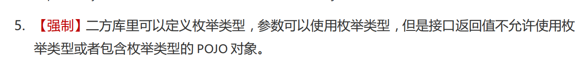
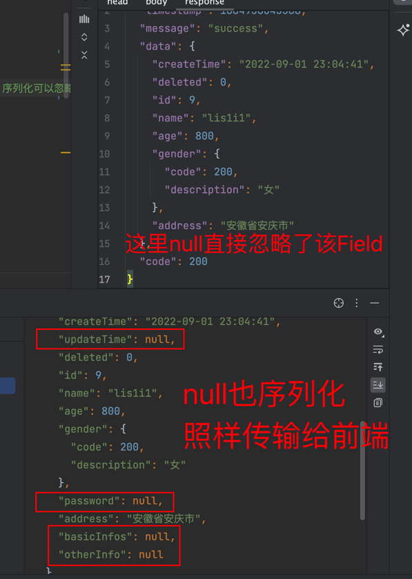

# SpringBoot+Mybatisplus中枚举正反序列化的实际应用

> 本文基于SpringBoot+Mybatisplus
>
框架就Java枚举的正反序列化的实际应用进行一次分析与研究，此外顺便带上DAO层关于枚举的操作，使得程序中完全使用枚举编程。由于SpringBoot内置的json处理器是jackson，所以本文的json相关处理也就是采用默认的jackson。

## 本文解决的痛点

枚举在前端的显示和数据库的存储问题，前端可以很方便知道枚举是啥意思，数据库能用int存储枚举，程序中使用枚举既能见名知意，也能提高代码可读性。

看图最直接：


## 背景

N久之前，leo曾经问我枚举的应用，我清楚地记得菜鸟教程(https://www.runoob.com/)上面有这样一段话。


当时我还找到了给leo看，说这玩意要被取代了.现在看来是我断章取义了。这里的枚举有遍历，穷举的意思，也就是此枚举非彼枚举。因为那时候很少会接触到枚举，所以我以为这玩意真的没救了。

现在看来，看多了不去实践与思考，正应了一句话“尽信书不如无书”。

最近《阿里巴巴开发规范-嵩山版版》有下面的一句话，可能会与接下来的内容相冲。阿里巴巴这个适合一定的场景（主要可能是大企业里面的系统之间的RPC调用比较多，如果采用枚举会导致升级后得全部更新其他依赖系统，这个规定其实有妥的地方也有不妥的地方，所以还是看场景需要而定。），与我使用的场景有点区别，
所以还是看是否适合自己的场景需要。



无论枚举要怎么使用，我还是按照自己的相关需求来实践了一把，由于项目中有很多枚举，使用和管理起来非常晕乎乎的。
需要把枚举与Integer转来转去，前端传输过来了一个Integer，需要手动将Integer转成枚举，存储到数据库的时候，又得将枚举转成Integer保存。
如果纯粹使用Integer传值，编码又不能知道这个数字代表啥意思，最后找来找去，注释也不全。不光是后端很是晕乎乎的。
前端由于也只接受了Integer，需要显示文字的时候，只能前后端共同定，一旦后端修改了枚举，那么前端则必须同步修改。
为了解决这个问题，我在网上找了一些解决办法，但是都不尽人意。最后折腾了jackson源码并求助于jackson的维护者解决了枚举正反序列化的问题。

## 基础框架

 框架           | 官网                                          | 版本             
--------------|---------------------------------------------|----------------
 SpringBoot   | https://spring.io/projects/spring-boot      | V2.2.9-GA      
 SpringWebMVC | https://spring.io/projects/spring-framework | 5.2.8.REALEASE 
 Mybatis-plus | https://mybatis.plus/                       | 3.4.0          
 jackson      | https://github.com/FasterXML/jackson        | 2.10.5         

> 上面的框架的各个版本可能代码有点差别，但是基本思想都是一样的，所以版本不会有很大影响。此外其他计算机语言或者框架实现本文的思想都是可以的。

## 模型介绍

先看下一般工程的基本模型


本文的重点是枚举的正反序列化，但是为了让整个枚举在工程中的应用比较完整，也会描述下枚举在DAO层的操作。jackson的正反序列化主要应用在Controller层的`参数接收`
与`结果返回`
。在参数接收的时候有两种形式，一种的前端通过表单提交的数据，另一种是从body提交的json数据，两种有很大的区别，在Controller的方法里面主要体现在body提交的json数据需要在对象前面加上`@RequestBody`
.当然两者本质上有点区别，由于表单提交的不是json，所以无法采用json反序列化，但是本文中会顺带描述到表单提交的数据如何转换成枚举。

## show you code

### 工程源代码

https://gitee.com/eric-tutorial/SpringCloud-multiple-gradle

> 篇幅有限，只讲述重点代码逻辑，完整的可以参考源代码。项目基于Gradle构建.

### 定义枚举

```java
public enum GenderEnum {

    BOY(100, "男"), GIRL(200, "女"), UNKNOWN(0, "未知");

    private final Integer code;

    private final String description;

    GenderEnum(int code, String description) {
        this.code = code;
        this.description = description;
    }

}
```

### 接受参数的对象

```java

@Data
public class UserParam {

    @NotBlank(message = "name不能为空")
    String name;

    @NotNull(message = "gender为1或者2")
    GenderEnum gender;

    @NotNull(message = "age不能为空")
    Integer age;

}

```

注意参数Field的上面校验注解不可以是lombok的，否则会改变字节码信息，导致类的Field与值无法识别，最后枚举反序列化失败

### Controller POST方法

```java
    @PostMapping("add/body")
public BaseResponseVO saveBody(@Valid @RequestBody UserParam userParam){
        UserModel userModel=userService.add(userParam);
        return BaseResponseVO.success(userModel);
        }
```

上面代码可以看出来框架在接受参数的时候将网络传输过来的数据进行了反序列化，在返回给前端的时候进行了正序列化成json返回的。
默认的jackson是无法直接按照`GenderEnum`中的`code`来正反序列化枚举的，因为jackson有一套自己的枚举序列化机制，从源代码中看出来，
它是按照`java.lang.Enum.class`的`name`和`ordinal`来正反序列化的。但是这个不能满足我自己定义的`code`和`description`
来正反序列化的需求。
因此我在网上搜了下，看看有木有人完成这样的需求，我想这个需求应该比较正常，网上一搜果然有很多，但是能实现的却没几个。
于是经过自己折腾，很快就有了下面的代码(最后发现都是采用默认的jackson枚举正反序列化器,并不满足需求，需要自己重写序列化器)。

### 自定义的枚举序列化器

#### 面向接口编程

为我需要正序列化的枚举统一定义了一个接口.所以需要参与正序列化的枚举都得实现这个接口.目的是为了不影响其他枚举的正常序列化，只序列化我自己特定的枚举。

```java
public interface BaseEnum {
    /**
     * Code integer.
     *
     * @return the integer
     */
    Integer code();

    /**
     * Description string.
     *
     * @return the string
     */
    String description();

}
```

#### 正序列化器

```java

@Slf4j
public class BaseEnumSerializer extends JsonSerializer<BaseEnum> {

    @Override
    public void serialize(BaseEnum value, JsonGenerator gen, SerializerProvider serializerProvider) throws IOException {

        log.info("\n====>开始序列化[{}]", value);
        gen.writeStartObject();
        gen.writeNumberField("code", value.code());
        gen.writeStringField("description", value.description());
        gen.writeEndObject();

    }

}
```

效果就是既返回`code`和`description`,前端既知道`code`也知道`description`.`description`可以直接显示,`code`
可以用来返回给后端的操作.前端再也不用同步修改`description`了,也不需要自己判断`code`是啥意思,直接显示`description`
即可.皆大欢喜.

#### 反序列化器

```java

@Slf4j
public class BaseEnumDeserializer extends JsonDeserializer<BaseEnum> {
    @Override
    public BaseEnum deserialize(JsonParser p, DeserializationContext ctxt) throws IOException, JsonProcessingException {

        try {
            //前端输入的值
            String inputParameter = p.getText();
            if (StringUtils.isBlank(inputParameter)) {
                return null;
            }

            JsonStreamContext parsingContext = p.getParsingContext();
            String currentName = parsingContext.getCurrentName();//字段名
            Object currentValue = parsingContext.getCurrentValue();//前端注入的对象(ResDTO)
            Field field = ReflectionUtils.getField(currentValue.getClass(), currentName);              // 通过对象和属性名获取属性的类型
            // 获取对应得枚举类
            Class enumClass = field.getType();
            // 根据对应的值和枚举类获取相应的枚举值
            BaseEnum anEnum = DefaultInputJsonToEnum.getEnum(inputParameter, enumClass);
            log.info("\n====>测试反序列化枚举[{}]==>[{}.{}]", inputParameter, anEnum.getClass(), anEnum);
            return anEnum;
        } catch (Exception e) {
            throw new RuntimeException(e);
        }
    }
}

```

效果就是反序列化器用来解决参数接受的时候,将前端传过来的`code`转成`Enum`.方便枚举在程序中的操作,降低程序的复杂度,使编码更加简单,代码清晰明了.

#### 注入到SpringBoot框架中

```java
    @Bean
public Jackson2ObjectMapperBuilderCustomizer enumCustomizer(){
//        将枚举转成json返回给前端
        return jacksonObjectMapperBuilder->{
//            自定义序列化器注入
        Map<Class<?>,JsonSerializer<?>>serializers=new LinkedHashMap<>();
        serializers.put(BaseEnum.class,new BaseEnumSerializer());
        jacksonObjectMapperBuilder.serializersByType(serializers);

//            自定义反序列化器注入,这里的注入貌似效果不行
        Map<Class<?>,JsonDeserializer<?>>deserializers=new LinkedHashMap<>();
        deserializers.put(BaseEnum.class,new BaseEnumDeserializer());
        jacksonObjectMapperBuilder.deserializersByType(deserializers);

        };
        }
```

经过测试，枚举序列化后返回到前端的效果如下，与期望的效果一致，这样的好处就是前端不需要管数字是啥意思，直接显示`description`
即可，无论后端枚举是否修改，前端都不需要关心了。


经过反复测试与人分享成果的时候，发现一个非常严重的问题，虽然前端接收参数的时候也可以反序列化成枚举，但是实际上没有按照`code`
来反序列化。最后只能把jackson的源代码拉下来调试，经过调试发现，jackson反序列化的时候一直使用的是默认的枚举反序列化器，并没有使用自定义枚举反序列化器。

com.fasterxml.jackson.databind.deser.BasicDeserializerFactory#createEnumDeserializer

```java
  /**
 * Factory method for constructing serializers of {@link Enum} types.
 */
@Override
public JsonDeserializer<?> createEnumDeserializer(DeserializationContext ctxt,
        JavaType type,BeanDescription beanDesc)
        throws JsonMappingException
        {
final DeserializationConfig config=ctxt.getConfig();
final Class<?> enumClass=type.getRawClass();
        // 23-Nov-2010, tatu: Custom deserializer?
        JsonDeserializer<?> deser=_findCustomEnumDeserializer(enumClass,config,beanDesc);

        if(deser==null){
        // 12-Feb-2020, tatu: while we can't really create real deserializer for `Enum.class`,
        //    it is necessary to allow it in one specific case: see [databind#2605] for details
        //    but basically it can be used as polymorphic base.
        //    We could check `type.getTypeHandler()` to look for that case but seems like we
        //    may as well simply create placeholder (AbstractDeserializer) regardless
        if(enumClass==Enum.class){
        return AbstractDeserializer.constructForNonPOJO(beanDesc);
        }

        ValueInstantiator valueInstantiator=_constructDefaultValueInstantiator(ctxt,beanDesc);
        SettableBeanProperty[]creatorProps=(valueInstantiator==null)?null
        :valueInstantiator.getFromObjectArguments(ctxt.getConfig());
        // May have @JsonCreator for static factory method:
        for(AnnotatedMethod factory:beanDesc.getFactoryMethods()){
        if(_hasCreatorAnnotation(ctxt,factory)){
        if(factory.getParameterCount()==0){ // [databind#960]
        deser=EnumDeserializer.deserializerForNoArgsCreator(config,enumClass,factory);
        break;
        }
        Class<?> returnType=factory.getRawReturnType();
        // usually should be class, but may be just plain Enum<?> (for Enum.valueOf()?)
        if(returnType.isAssignableFrom(enumClass)){
        deser=EnumDeserializer.deserializerForCreator(config,enumClass,factory,valueInstantiator,creatorProps);
        break;
        }
        }
        }

        // Need to consider @JsonValue if one found
        if(deser==null){
        deser=new EnumDeserializer(constructEnumResolver(enumClass,
        config,beanDesc.findJsonValueAccessor()),
        config.isEnabled(MapperFeature.ACCEPT_CASE_INSENSITIVE_ENUMS));
        }
        }

        // and then post-process it too
        if(_factoryConfig.hasDeserializerModifiers()){
        for(BeanDeserializerModifier mod:_factoryConfig.deserializerModifiers()){
        deser=mod.modifyEnumDeserializer(config,type,beanDesc,deser);
        }
        }
        return deser;
        }
```

从上面可以看出来枚举反系列化器是怎么找到的.仔细阅读后发现,上面并没有按照接口 `BaseEnum` 来查找反序列化器,这也是为啥自定义的反序列化器没有生效的原因.

既然我发现了这个问题，我直接在github拉下来了jackson代码，然后修改成按照接口查找自定义反序列化器的方式提交了我的代码.

```java
    List<JavaType> interfaces=type.getInterfaces();

        for(JavaType javaType:interfaces){
        Class<?> rawClass=javaType.getRawClass();
        deser=_findCustomEnumDeserializer(rawClass,config,beanDesc);
        if(deser!=null){
        return deser;
        }
        }
```

pull request之后，管理者很快给我回复了。我们来回扯了几个回合之后，我们得到一个更加合理的解决办法.
这个问题，这个也是本文的重点。就是重写查找枚举反序列化器的方法,把我写的代码放在一个重写类里面即可.

https://github.com/FasterXML/jackson-databind/pull/2842


于是下面的代码就来了，依据开闭原则，修改源代码的事情不太能发生，管理者说修改违背了原有的思想，所以我的PR最后被我自己关闭了。

com.fasterxml.jackson.databind.module.SimpleDeserializers#findEnumDeserializer

```java
    @Override
public JsonDeserializer<?> findEnumDeserializer(Class<?> type,
        DeserializationConfig config,BeanDescription beanDesc)
        throws JsonMappingException
        {
        if(_classMappings==null){
        return null;
        }
        JsonDeserializer<?> deser=_classMappings.get(new ClassKey(type));
        if(deser==null){
        // 29-Sep-2019, tatu: Not 100% sure this is workable logic but leaving
        //   as is (wrt [databind#2457]. Probably works ok since this covers direct
        //   sub-classes of `Enum`; but even if custom sub-classes aren't, unlikely
        //   mapping for those ever requested for deserialization
        if(_hasEnumDeserializer&&type.isEnum()){
        deser=_classMappings.get(new ClassKey(Enum.class));
        }
        }
        return deser;
        }
```

从上面看出来这个就是查找枚举反序列化器的逻辑,重写SimpleDeserializers类即可.上面这个代码是无法按照接口找到反序列化器的,所以重写它,让它按照我期望的接口方式找到即可,最后也成功了.

此外还从源码中分析出来
为啥有的枚举反序列化就能正常，但是有的不能完成翻序列化。原来默认的枚举反序列化器是按照`ordinal`
来反序列化的，也就是说只有当`code`与`ordinal`一致的时候就会造成一种假象，
以为是`code`反序列化来的，其实依旧是`ordinal`反序列化来的。

从下面代码中可以看出来,枚举存储在数组中,而`ordinal`刚好是下标.

com.fasterxml.jackson.databind.deser.std.EnumDeserializer#deserialize

```java
    @Override
public Object deserialize(JsonParser p,DeserializationContext ctxt)throws IOException
        {
        JsonToken curr=p.currentToken();

        // Usually should just get string value:
        if(curr==JsonToken.VALUE_STRING||curr==JsonToken.FIELD_NAME){
        CompactStringObjectMap lookup=ctxt.isEnabled(DeserializationFeature.READ_ENUMS_USING_TO_STRING)
        ?_getToStringLookup(ctxt):_lookupByName;
final String name=p.getText();
        Object result=lookup.find(name);
        if(result==null){
        return _deserializeAltString(p,ctxt,lookup,name);
        }
        return result;
        }
        // But let's consider int acceptable as well (if within ordinal range)
        if(curr==JsonToken.VALUE_NUMBER_INT){
        // ... unless told not to do that
        int index=p.getIntValue();
        if(ctxt.isEnabled(DeserializationFeature.FAIL_ON_NUMBERS_FOR_ENUMS)){
        return ctxt.handleWeirdNumberValue(_enumClass(),index,
        "not allowed to deserialize Enum value out of number: disable DeserializationConfig.DeserializationFeature.FAIL_ON_NUMBERS_FOR_ENUMS to allow"
        );
        }
        if(index>=0&&index<_enumsByIndex.length){
        return _enumsByIndex[index];
        }
        if((_enumDefaultValue!=null)
        &&ctxt.isEnabled(DeserializationFeature.READ_UNKNOWN_ENUM_VALUES_USING_DEFAULT_VALUE)){
        return _enumDefaultValue;
        }
        if(!ctxt.isEnabled(DeserializationFeature.READ_UNKNOWN_ENUM_VALUES_AS_NULL)){
        return ctxt.handleWeirdNumberValue(_enumClass(),index,
        "index value outside legal index range [0..%s]",
        _enumsByIndex.length-1);
        }
        return null;
        }
        return _deserializeOther(p,ctxt);
        }

```


> 除了上面特殊的传参方式，也是支持原样返回，即回传自定义序列化的结果。这种场景会在redis，mq,mongodb存储中应用到。
>  ```json
>   POST http://localhost:8080/user/add/body
>    Content-Type: application/json
>    Accept: application/json
>    
>    {
>       "gender": {
>           "code": 200,
>           "description": "女"
>       },
>       "name": "lis1i1",
>       "age": 23
>    }
>```


> Java的枚举本质上是java.lang.Enum.class，自带有ordinal和name两个属性。ordinal可以理解成数组的下标。

调试过程中最让人百思不得解的是，自定义的正反枚举序列化器，序列化器是可以按照自己定义的接口来序列化，但是反序列化不行。最后经过反复调试，发现正反序列化过程有点区别，正序列化的时候会找父类找接口，按照父类或者接口定义的序列化器来序列化。而反序列化的时候不会。体会一下，可以理解成一个正序列化的时候，准确度可以忽略，反正都是丢出去的。但是反序列化的时候必须保证精度，否则无法正确反序列化，那么对应的对象无法获取到正确的值。瞎扯一下.好比，银行存钱的时候不需要密码，取钱的时候就需要密码一样，看似一个对称的过程，但是校验机制还是有点区别的,可以细细体会这种方式的必要性。

#### 重写SimpleDeserializers的findEnumDeserializer方法

重写了这个方法之后，把我原本写在源代码的逻辑搬出来了，很快就解决了枚举无法找到自定义反序列化器的问题。

```java
public class SimpleDeserializersWrapper extends SimpleDeserializers {

    static final Logger logger = LoggerFactory.getLogger(SimpleDeserializersWrapper.class);

    @Override
    public JsonDeserializer<?> findEnumDeserializer(Class<?> type, DeserializationConfig config, BeanDescription beanDesc) throws JsonMappingException {

        JsonDeserializer<?> enumDeserializer = super.findEnumDeserializer(type, config, beanDesc);

        if (enumDeserializer != null) {
            return enumDeserializer;
        }
        for (Class<?> typeInterface : type.getInterfaces()) {
            enumDeserializer = this._classMappings.get(new ClassKey(typeInterface));
            if (enumDeserializer != null) {
                logger.info("\n====>重写枚举查找逻辑[{}]", enumDeserializer);
                return enumDeserializer;
            }
        }
        return null;

    }
}

```

### 换种方式注入到SpringBoot

放弃之前的注入方式，换用新的注入方式向jackson注册重写的类SimpleDeserializersWrapper。

```java
    @Bean
public ObjectMapper objectMapper(Jackson2ObjectMapperBuilder builder){
        SimpleDeserializersWrapper deserializers=new SimpleDeserializersWrapper();
        deserializers.addDeserializer(BaseEnum.class,new BaseEnumDeserializer());

        SimpleModule simpleModule=new SimpleModule();
        simpleModule.setDeserializers(deserializers);
        simpleModule.addSerializer(BaseEnum.class,new BaseEnumSerializer());

        ObjectMapper objectMapper=builder.createXmlMapper(false).build();
        objectMapper.registerModule(simpleModule);
        return objectMapper;
        }
```

### 其他序列化应用场景

#### 时间格式统一序列化

一般来说，会在Date上满加上时间序列化的注解`@JsonFormat`，但是也可以针对Date自定义正反序列化器，就可以很轻松解决问题。

> 仔细阅读jackson的源代码你会发现这个还是里面有很多的默认序列化器,用来解决一些常用的类型序列化.

#### Long类型超过精度统一序列化

本项目中还有一个应用就是针对Long类型超过浏览器可识别的精度范围就直接序列化成String类型，这样就不用再每个返回的地方都一一String.valueof()
的转化了。

> Long类型太长了，在浏览器里面是无法正确显示的，但是实际值是没有问题的，只是看起来不对而已。

### 表单提交的数据转成枚举

表单提交的数据与jackson没有关系，主要与SpringWebMVC有关系，所以具体可以看工程源代码，应用比较简单，但是底层原理可以看看Spring源代码。


### DAO 层处理枚举存到数据库

具体就是在枚举的属性上面上一个注解

```java
   @EnumValue//标记数据库存的值是code
private final Integer code;
```

此外在yaml配置文件中指定枚举所在的包。

```java
mybatis-plus:
        type-enums-package:hxy.dream.entity.enums
```

上面两步，就是借助mybatis-plus完成了枚举存储到数据库，与读取的时候转换的问题。这个比较简单，框架也就是做这些事情的，让开发者专注于业务，而不是实现技术的本身（不是说不要钻研技术底层原理）。

> 参考 mybatis-plus:https://mp.baomidou.com/guide/enum.html

## 总结

以上的操作完成了枚举的从前端接收，反序列化成枚举对象在程序中表达。然后再存储到数据库中。从数据库中取code转成枚举，在程序中表达，再序列化枚举后传输给前端。一个非常完整的循环，基本上满足了程序中对枚举使用的需求。

---

# 国际化方案

国际化是多语言处理，也就是网站不仅支持中文，还支持其他语言，例如英文。

https://gitee.com/-/ide/project/aohanhongzhi/springboot-base/edit/master/-/src/main/java/hxy/base/server/entity/enums/BaseStatusCodeEnum.java

# mybatis xml兼容处理

mybatis的xml文件会报下面错误

```java
org.mybatis.spring.MyBatisSystemException:nested exception is org.apache.ibatis.exceptions.PersistenceException:
        ### Error querying database.Cause:java.lang.IllegalArgumentException:invalid comparison:com.bosch.project.install.domain.enums.InstallStatusEnum and java.lang.String
        ### Cause:java.lang.IllegalArgumentException:invalid comparison:com.bosch.project.install.domain.enums.InstallStatusEnum and java.lang.String

        at org.mybatis.spring.MyBatisExceptionTranslator.translateExceptionIfPossible(MyBatisExceptionTranslator.java:96)
        at org.mybatis.spring.SqlSessionTemplate$SqlSessionInterceptor.invoke(SqlSessionTemplate.java:441)
        at jdk.proxy2/jdk.proxy2.$Proxy140.selectList(Unknown Source)
        at org.mybatis.spring.SqlSessionTemplate.selectList(SqlSessionTemplate.java:224)
        at com.baomidou.mybatisplus.core.override.MybatisMapperMethod.executeForMany(MybatisMapperMethod.java:166)
        at com.baomidou.mybatisplus.core.override.MybatisMapperMethod.execute(MybatisMapperMethod.java:77)
        at com.baomidou.mybatisplus.core.override.MybatisMapperProxy$PlainMethodInvoker.invoke(MybatisMapperProxy.java:148)
        at com.baomidou.mybatisplus.core.override.MybatisMapperProxy.invoke(MybatisMapperProxy.java:89)
        at jdk.proxy2/jdk.proxy2.$Proxy183.selectSpfInstallApplicationJoinList(Unknown Source)
        at com.bosch.project.install.mapper.InstallApplicationMapperTest.test(InstallApplicationMapperTest.java:26)
        at java.base/jdk.internal.reflect.NativeMethodAccessorImpl.invoke0(Native Method)
        at java.base/jdk.internal.reflect.NativeMethodAccessorImpl.invoke(NativeMethodAccessorImpl.java:77)
        at java.base/jdk.internal.reflect.DelegatingMethodAccessorImpl.invoke(DelegatingMethodAccessorImpl.java:43)
        at java.base/java.lang.reflect.Method.invoke(Method.java:568)
        at org.junit.runners.model.FrameworkMethod$1.runReflectiveCall(FrameworkMethod.java:50)
        at org.junit.internal.runners.model.ReflectiveCallable.run(ReflectiveCallable.java:12)
        at org.junit.runners.model.FrameworkMethod.invokeExplosively(FrameworkMethod.java:47)
        at org.junit.internal.runners.statements.InvokeMethod.evaluate(InvokeMethod.java:17)
        at org.springframework.test.context.junit4.statements.RunBeforeTestExecutionCallbacks.evaluate(RunBeforeTestExecutionCallbacks.java:74)
        at org.springframework.test.context.junit4.statements.RunAfterTestExecutionCallbacks.evaluate(RunAfterTestExecutionCallbacks.java:84)
        at org.springframework.test.context.junit4.statements.RunBeforeTestMethodCallbacks.evaluate(RunBeforeTestMethodCallbacks.java:75)
        at org.springframework.test.context.junit4.statements.RunAfterTestMethodCallbacks.evaluate(RunAfterTestMethodCallbacks.java:86)
        at org.springframework.test.context.junit4.statements.SpringRepeat.evaluate(SpringRepeat.java:84)
        at org.junit.runners.ParentRunner.runLeaf(ParentRunner.java:325)
        at org.springframework.test.context.junit4.SpringJUnit4ClassRunner.runChild(SpringJUnit4ClassRunner.java:251)
        at org.springframework.test.context.junit4.SpringJUnit4ClassRunner.runChild(SpringJUnit4ClassRunner.java:97)
        at org.junit.runners.ParentRunner$3.run(ParentRunner.java:290)
        at org.junit.runners.ParentRunner$1.schedule(ParentRunner.java:71)
        at org.junit.runners.ParentRunner.runChildren(ParentRunner.java:288)
        at org.junit.runners.ParentRunner.access$000(ParentRunner.java:58)
        at org.junit.runners.ParentRunner$2.evaluate(ParentRunner.java:268)
        at org.springframework.test.context.junit4.statements.RunBeforeTestClassCallbacks.evaluate(RunBeforeTestClassCallbacks.java:61)
        at org.springframework.test.context.junit4.statements.RunAfterTestClassCallbacks.evaluate(RunAfterTestClassCallbacks.java:70)
        at org.junit.runners.ParentRunner.run(ParentRunner.java:363)
        at org.springframework.test.context.junit4.SpringJUnit4ClassRunner.run(SpringJUnit4ClassRunner.java:190)
        at org.junit.runner.JUnitCore.run(JUnitCore.java:137)
        at com.intellij.junit4.JUnit4IdeaTestRunner.startRunnerWithArgs(JUnit4IdeaTestRunner.java:69)
        at com.intellij.rt.junit.IdeaTestRunner$Repeater$1.execute(IdeaTestRunner.java:38)
        at com.intellij.rt.execution.junit.TestsRepeater.repeat(TestsRepeater.java:11)
        at com.intellij.rt.junit.IdeaTestRunner$Repeater.startRunnerWithArgs(IdeaTestRunner.java:35)
        at com.intellij.rt.junit.JUnitStarter.prepareStreamsAndStart(JUnitStarter.java:235)
        at com.intellij.rt.junit.JUnitStarter.main(JUnitStarter.java:54)
        Caused by:org.apache.ibatis.exceptions.PersistenceException:
        ### Error querying database.Cause:java.lang.IllegalArgumentException:invalid comparison:com.bosch.project.install.domain.enums.InstallStatusEnum and java.lang.String
        ### Cause:java.lang.IllegalArgumentException:invalid comparison:com.bosch.project.install.domain.enums.InstallStatusEnum and java.lang.String
        at org.apache.ibatis.exceptions.ExceptionFactory.wrapException(ExceptionFactory.java:30)
        at org.apache.ibatis.session.defaults.DefaultSqlSession.selectList(DefaultSqlSession.java:149)
        at org.apache.ibatis.session.defaults.DefaultSqlSession.selectList(DefaultSqlSession.java:140)
        at java.base/jdk.internal.reflect.NativeMethodAccessorImpl.invoke0(Native Method)
        at java.base/jdk.internal.reflect.NativeMethodAccessorImpl.invoke(NativeMethodAccessorImpl.java:77)
        at java.base/jdk.internal.reflect.DelegatingMethodAccessorImpl.invoke(DelegatingMethodAccessorImpl.java:43)
        at java.base/java.lang.reflect.Method.invoke(Method.java:568)
        at org.mybatis.spring.SqlSessionTemplate$SqlSessionInterceptor.invoke(SqlSessionTemplate.java:427)
        ...40more
        Caused by:java.lang.IllegalArgumentException:invalid comparison:com.bosch.project.install.domain.enums.InstallStatusEnum and java.lang.String
        at org.apache.ibatis.ognl.OgnlOps.compareWithConversion(OgnlOps.java:98)
        at org.apache.ibatis.ognl.OgnlOps.isEqual(OgnlOps.java:153)
        at org.apache.ibatis.ognl.OgnlOps.equal(OgnlOps.java:814)
        at org.apache.ibatis.ognl.ASTNotEq.getValueBody(ASTNotEq.java:53)
        at org.apache.ibatis.ognl.SimpleNode.evaluateGetValueBody(SimpleNode.java:212)
        at org.apache.ibatis.ognl.SimpleNode.getValue(SimpleNode.java:258)
        at org.apache.ibatis.ognl.ASTAnd.getValueBody(ASTAnd.java:61)
        at org.apache.ibatis.ognl.SimpleNode.evaluateGetValueBody(SimpleNode.java:212)
        at org.apache.ibatis.ognl.SimpleNode.getValue(SimpleNode.java:258)
        at org.apache.ibatis.ognl.Ognl.getValue(Ognl.java:560)
        at org.apache.ibatis.ognl.Ognl.getValue(Ognl.java:524)
        at org.apache.ibatis.scripting.xmltags.OgnlCache.getValue(OgnlCache.java:46)
        at org.apache.ibatis.scripting.xmltags.ExpressionEvaluator.evaluateBoolean(ExpressionEvaluator.java:32)
        at org.apache.ibatis.scripting.xmltags.IfSqlNode.apply(IfSqlNode.java:34)
        at org.apache.ibatis.scripting.xmltags.MixedSqlNode.lambda$apply$0(MixedSqlNode.java:32)
        at java.base/java.util.ArrayList.forEach(ArrayList.java:1511)
        at org.apache.ibatis.scripting.xmltags.MixedSqlNode.apply(MixedSqlNode.java:32)
        at org.apache.ibatis.scripting.xmltags.TrimSqlNode.apply(TrimSqlNode.java:55)
        at org.apache.ibatis.scripting.xmltags.MixedSqlNode.lambda$apply$0(MixedSqlNode.java:32)
        at java.base/java.util.ArrayList.forEach(ArrayList.java:1511)
        at org.apache.ibatis.scripting.xmltags.MixedSqlNode.apply(MixedSqlNode.java:32)
        at org.apache.ibatis.scripting.xmltags.DynamicSqlSource.getBoundSql(DynamicSqlSource.java:39)
        at org.apache.ibatis.mapping.MappedStatement.getBoundSql(MappedStatement.java:305)
        at com.github.pagehelper.PageInterceptor.intercept(PageInterceptor.java:82)
        at org.apache.ibatis.plugin.Plugin.invoke(Plugin.java:61)
        at jdk.proxy2/jdk.proxy2.$Proxy238.query(Unknown Source)
        at org.apache.ibatis.session.defaults.DefaultSqlSession.selectList(DefaultSqlSession.java:147)
        ...46more

```


删除下面圈出内容即可，其他不需要变化。查询结果映射也是正常的，没有问题。


# 问题拓展

有一位网友搜了很多的文章内容，都没有找到有效的，最后扒到了我这篇文章。但是使用的时候遇到了一个问题。下面这段代码总是无法获取到已经注入成功的BaseEnumDeserializer对象,
调试确定这个`this._classMappings`里面是有值的。但是get一直为空。

```java

for(Class<?> typeInterface:type.getInterfaces()){
        enumDeserializer=this._classMappings.get(new ClassKey(typeInterface));
        if(enumDeserializer!=null){
        logger.info("\n重写枚举查找逻辑[{}]",enumDeserializer);
        return enumDeserializer;
        }
        }
        return null;
```

问题分析，调试定位出问题肯定不是序列化器注入的问题，因为已经在`this._classMappings`中存在了。那么问题只能出在HashMap的key上面了。通过调试

```java
this._classMappings.get(key);
```

这一个比较发现


经过计算结果是：


很显然这位老哥import的时候包可能导入错误的了。

```java
  // 下面这个才是正确的

import com.fasterxml.jackson.databind.type.ClassKey;
// 下面这个是错误的。
import com.fasterxml.classmate.util.ClassKey;
```


# fastjson枚举自定义序列化器

https://blog.csdn.net/qq_26680031/article/details/83473643

# 数据库的json序列化处理，将数据库存储的json字段自动映射成对象

https://github.com/baomidou/mybatis-plus-samples/tree/master/mybatis-plus-sample-typehandler/src/main/java/com/baomidou/mybatisplus/samples/typehandler

# json时间格式化

### 编码

参考 [DateJsonSerializer](common/src/main/java/hxy/dream/common/serializer/DateJsonSerializer.java)

1. 线程安全

```java
  DateTimeFormatter dtf=DateTimeFormatter.ofPattern("yyyy-MM-dd HH:mm:ss");
        ZoneId zoneId=ZoneId.systemDefault();
        LocalDateTime localDateTime=date.toInstant().atZone(zoneId).toLocalDateTime();
        String yearMonth=localDateTime.format(dtf);
```

2. 线程不安全

```java
  public static final SimpleDateFormat format=new SimpleDateFormat("yyyy-MM-dd HH:mm:ss");
        String dateStirng=format.format(date)
```

> https://www.cnblogs.com/xwzp/p/14685452.html

# @JsonInclude(Include.NON_NULL)全局配置

配置对象Field属性，当值为null的时候，就可以序列化忽略掉。



https://blog.csdn.net/u012477144/article/details/99731418

```
spring.jackson.default-property-inclusion=non_null
```
或者

```java
@Configuration
@EnableWebMvc
@Slf4j
public class WebMvcConfig extends WebMvcConfigurerAdapter {
   
    //@JsonInclude(Include.NON_NULL)全局配置
    @Override
    public void configureMessageConverters(List<HttpMessageConverter<?>> converters){
        Jackson2ObjectMapperBuilder builder = new Jackson2ObjectMapperBuilder()
                .serializationInclusion(JsonInclude.Include.NON_NULL);
        converters.add(new MappingJackson2HttpMessageConverter(builder.build()));
    }
}
```
# 解决 redis 序列化 java8 LocalDateTime 问题

https://blog.csdn.net/zhuzhoulin/article/details/106758473

### 配置文件


