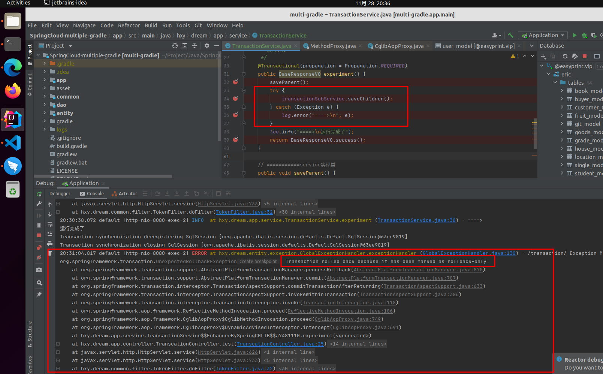
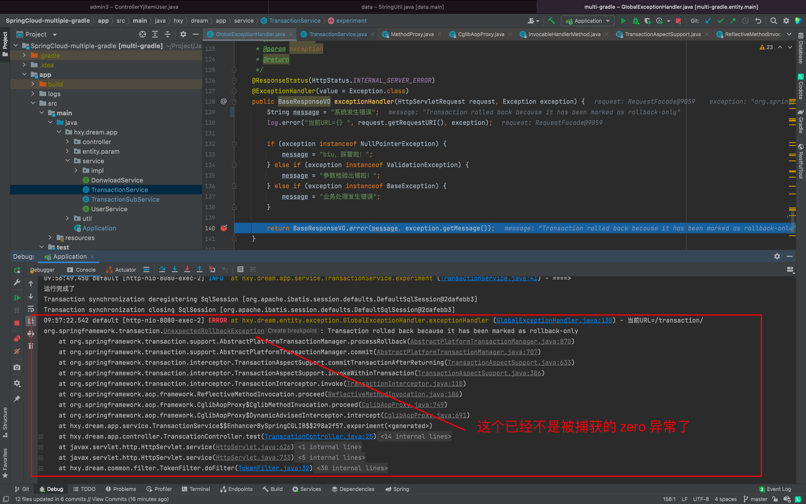
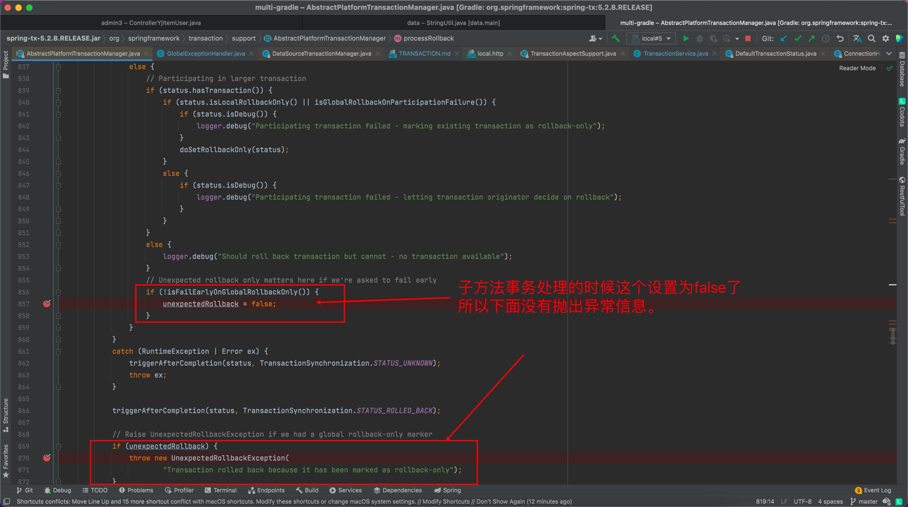
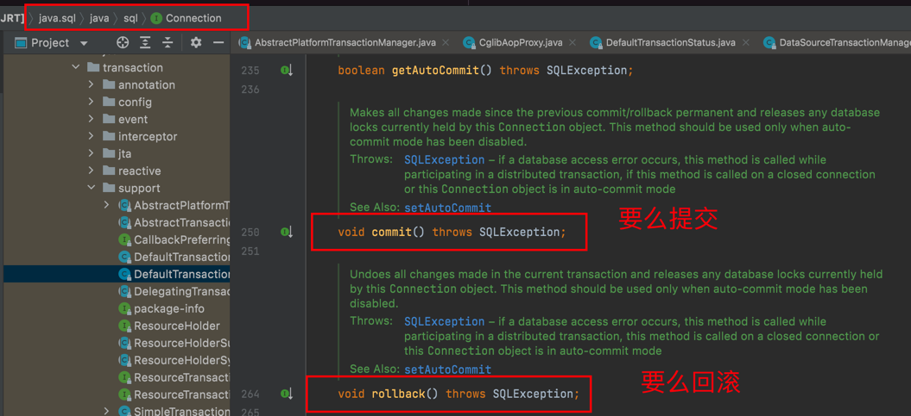

事物研究
===

古人学问无遗力，少壮工夫老始成。纸上得来终觉浅，绝知此事要躬行。

# 事务基础概念

# 事务四大特性

# 事务传播传播行为

 事务七大传播机制，五大隔离机制。

[详解事务的7种传播行为](https://blog.csdn.net/qq_34115899/article/details/115602002)

[Spring事务传播行为详解](https://segmentfault.com/a/1190000013341344)


子方法发生异常并且try catch捕获了异常，也会引起事务回滚，因为子方法和父方法是在 **同一个事务中** 。

下面这个异常是因为嵌套事务的子方法的异常被捕获了，在父方法里面没有获取到异常了。所以抛出下面这个异常，具体可以分析源码理解。
嵌套事务的时候，子方法出现异常，是先弄一个回滚标记了，所以并没有真正处理，只是在最后父方法提交事务之前发现有回滚标记，但是没有异常了。

重点是不应该直接捕获异常，如果希望异常不影响父方法，那么其实可以拆分事务，采用其他事务传播机制，具体可以研究下。

```java
Transaction rolled back because it has been marked as rollback-only
```




> 事务回滚默认是只针对运行时异常，一般来说都会指定好针对的异常。由rollbackFor指定。

Mark the resource transaction as rollback-only.
```java
	/**
	 * Mark the resource transaction as rollback-only.
	 */
	public void setRollbackOnly() {
		this.rollbackOnly = true;
	}
```
关于rollback-only的解释：一般来说就是要么rollback要么就是commit，如果设置为rollback-only，那么已经就是不会commit了。


[Spring事务嵌套引发的血案---Transaction rolled back because it has been marked as rollback-only](https://www.cnblogs.com/nizuimeiabc1/p/14774125.html)

# 事务的五大隔离机制

[什么是脏读、不可重复读、幻读？](https://www.zhihu.com/question/458275373)


# 事务应用场景

# 事务的失效场景

