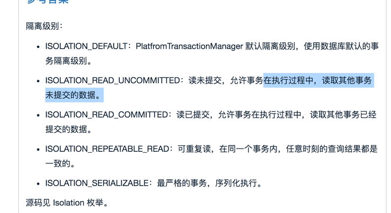
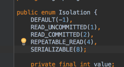
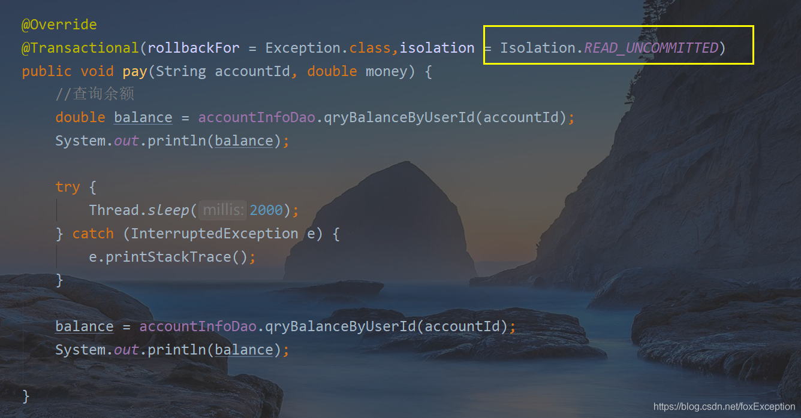

事物研究
===

古人学问无遗力，少壮工夫老始成。纸上得来终觉浅，绝知此事要躬行。

# 事务基础概念

# 事务四大特性

ACID

# 事务传播传播行为

 事务七大传播机制，五大隔离机制。

[详解事务的7种传播行为](https://blog.csdn.net/qq_34115899/article/details/115602002)

[Spring事务传播行为详解](https://segmentfault.com/a/1190000013341344)


子方法发生异常并且try catch捕获了异常，也会引起事务回滚，因为子方法和父方法是在 **同一个事务中** 。

下面这个异常是因为嵌套事务的子方法的异常被捕获了，在父方法里面没有获取到异常了。所以抛出下面这个异常，具体可以分析源码理解。
嵌套事务的时候，子方法出现异常，是先弄一个回滚标记了，所以并没有真正处理，只是在最后父方法提交事务之前发现有回滚标记，但是没有异常了。

重点是不应该直接捕获异常，如果希望异常不影响父方法，那么其实可以拆分事务，采用其他事务传播机制，具体可以研究下。

```java
Transaction rolled back because it has been marked as rollback-only
```


> 事务回滚默认是只针对运行时异常，一般来说都会指定好针对的异常。由rollbackFor指定。

Mark the resource transaction as rollback-only.
```java
	/**
	 * Mark the resource transaction as rollback-only.
	 */
	public void setRollbackOnly() {
		this.rollbackOnly = true;
	}
```
关于rollback-only的解释：一般来说就是要么rollback要么就是commit，如果设置为rollback-only，那么已经就是不会commit了。


[Spring事务嵌套引发的血案---Transaction rolled back because it has been marked as rollback-only](https://www.cnblogs.com/nizuimeiabc1/p/14774125.html)

# 事务的五大隔离机制

Spring的事务五大隔离机制与数据库也是一一对应的，就是多了一个默认的，也就是采用数据库的。





事务隔离机制也是在下面注解中使用的


### [Spring事务隔离级别与MySQL设置的级别不一样怎么办](https://blog.csdn.net/foxException/article/details/109028373) ：结论是`Spring设置的隔离级别会生效`。
上面这个在实践的时候，第一次未成功复现，原因是因为mybatis的一级缓存，导致同一个事务的第二次查询压根没有实际执行，而是读取了第一次的缓存。
只要禁用了
```shell

==>  Preparing: SELECT id,name,age,gender,password,create_time,update_time,deleted FROM user_model WHERE id=? AND deleted=0
==> Parameters: 1(Integer)
<==    Columns: id, name, age, gender, password, create_time, update_time, deleted
<==        Row: 1, 张三, 1, null, null, null, null, 0
<==      Total: 1
=====>第一次查询信息UserModel(id=1, name=张三, age=1, gender=null, password=null)

==>  Preparing: UPDATE user_model SET age=?, update_time=? WHERE id=? AND deleted=0
==> Parameters: 9(Integer), 2021-11-29T16:50:24.196832(LocalDateTime), 1(Integer)
<==    Updates: 1

==>  Preparing: SELECT id,name,age,gender,password,create_time,update_time,deleted FROM user_model WHERE id=? AND deleted=0
==> Parameters: 1(Integer)
<==    Columns: id, name, age, gender, password, create_time, update_time, deleted
<==        Row: 1, 张三, 9, null, null, null, 2021-11-29 16:50:24, 0
<==      Total: 1
=====>第二次查询信息UserModel(id=1, name=张三, age=9, gender=null, password=null)，是脏数据

Exception in thread "Thread-3" java.lang.ArithmeticException: / by zero
	at hxy.dream.app.service.TransactionService.isolation1(TransactionService.java:89)
	at hxy.dream.app.service.TransactionService$$FastClassBySpringCGLIB$$6b7cc68d.invoke(<generated>)

```

[springboot+mybatis一级缓存启用/禁用问题](https://blog.csdn.net/NongYeting/article/details/106408985)

[什么是脏读、不可重复读、幻读？](https://www.zhihu.com/question/458275373)


# 事务应用场景

# 事务的失效场景

