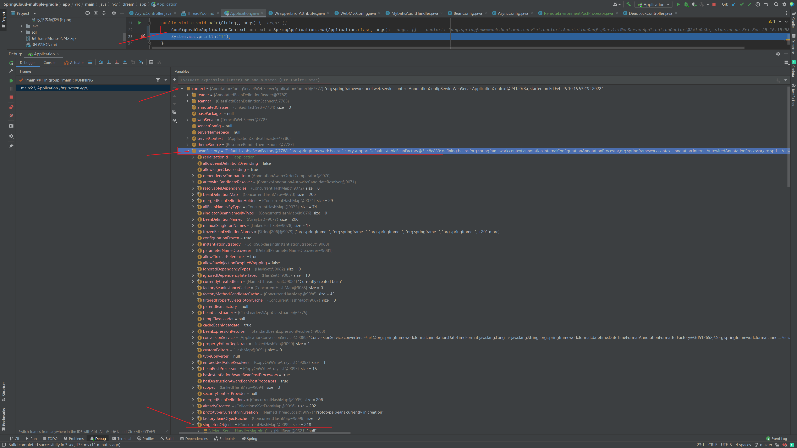
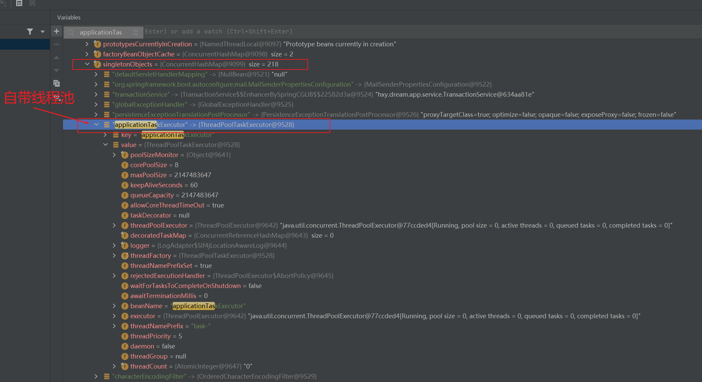
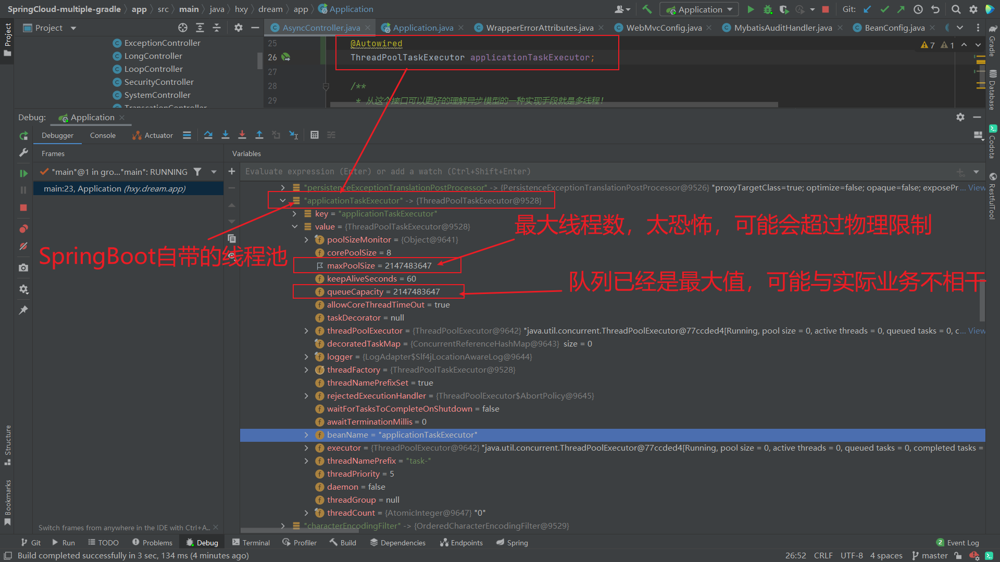

线程池研究
===

1. [Java 线程池会自动关闭吗？](https://blog.csdn.net/weixin_43207056/article/details/103438809)
2. [面试问我，创建多少个线程合适？我该怎么说](https://docs.qq.com/doc/DSEJ2VGl4S0dodmtK)
3. [两个活动的并发控制](https://aohanhongzhi.gitee.io/study/#/src/%E5%B9%B6%E5%8F%91/%E7%BA%BF%E7%A8%8B%E4%BC%98%E5%8C%96)
```java
    private ThreadPoolExecutor executor = new ThreadPoolExecutor(5, 10, 200, TimeUnit.MILLISECONDS,
        new LinkedBlockingQueue<Runnable>(5), new ThreadPoolExecutor.CallerRunsPolicy());


  //  存在返回值 Callable
    Future<?> submit = executor.submit(() -> {
        return 1;
    });

    try {
        // 获取Callable的返回值
        Object o = submit.get();
        log.info("\n====>{}",o);
    } catch (InterruptedException e) {
        e.printStackTrace();
        }catch(ExecutionException e){
        e.printStackTrace();
        }
```

直接调用 [ThreadPoolExecutorTool.java](common%2Fsrc%2Fmain%2Fjava%2Fhxy%2Fdream%2Fcommon%2Futil%2FThreadPoolExecutorTool.java)

## SpringBoot的自带线程池





## 守护线程与非守护线程的区别

java中两类线程：User Thread（用户线程）和Daemon Thread（守护线程）。

任何一个守护线程都会守护整个JVM中所有的非守护线程，只要当前JVM中还有任何一个非守护线程没有结束，守护线程就全部工作，当所有的非守护线程全部结束后，守护线程也会随着JVM一同结束。守护线程最典型的应用就是GC（垃圾回收器）。

需要注意的地方： 1、thread.setDaemon(true)方法必须在thread.start()之前设置，否则会报IllegalThreadStateException异常，不能把正在运行的常规线程设置为守护线程。
2、在守护线程中产生的新线程也是守护线程。 3、不是所有应用都可以分配守护线程来进行服务，比如读写操作或是计算逻辑等。因为如果非守护线程都结束了，但是读写或计算逻辑没有完成，守护线程也会停止。

判断线程是否为守护线程的方法是：isDaemon()，返回true为守护线程，返回false为非守护线程

main线程是非守护线程，所以main线程提前结束会影响其他线程的执行，这个在Python里面 也是这样的。
