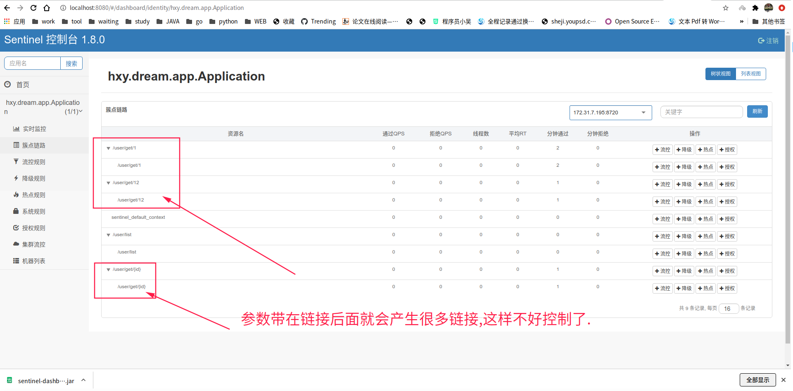

Springboot集成sentinel实现接口限流入门
===

原文:[https://blog.csdn.net/tianyaleixiaowu/article/details/89916891](https://blog.csdn.net/tianyaleixiaowu/article/details/89916891)

### sentinel-server

https://github.com/alibaba/Sentinel/releases 在这个地址，下载release的jar，然后启动即可。

这个jar是个标准的Springboot应用，可以通过

java -jar sentinel-dashboard-1.6.0.jar来启动，这样就是默认的设置，启动在8080端口。也可以加上一些自定义配置来启动

java -Dserver.port=8080 -Dcsp.sentinel.dashboard.server=localhost:8080 -Dproject.name=sentinel-dashboard -jar sentinel-dashboard.jar。具体配置的解释，可以到GitHub上看一下文档。

这里我们直接使用默认java -jar sentinel-dashboard-1.6.0.jar来启动，之后访问localhost:8080。

### sentinel-client

客户端应用集成

maven
```xml
    <dependency>
        <groupId>org.springframework.cloud</groupId>
        <artifactId>spring-cloud-starter-alibaba-sentinel</artifactId>
    </dependency>
```
gradle
```
    compile group: 'org.springframework.cloud', name: 'spring-cloud-starter-alibaba-sentinel', version: '0.9.0.RELEASE'
```

### 使用体会

对于 `@PathVariable("id")` 这种貌似不是很好的拦截和配置,因为最后一个也算是url,但是实际上是参数,不定性很大.不可以通过正则匹配,需要定制化解决.



解决方案: https://blog.csdn.net/codemaster_2071/article/details/89479749