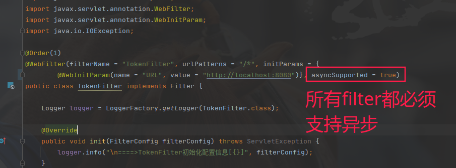

TokenFilter不支持异步
```java

19:34:06.371 default [http-nio-8080-exec-1] ERROR at org.apache.juli.logging.DirectJDKLog.log (DirectJDKLog.java:175) - Servlet.service() for servlet [hxy.dream.app.controller.servlet.AsyncRunningServlet] in context with path [] threw exception
java.lang.IllegalStateException: A filter or servlet of the current chain does not support asynchronous operations.
at org.apache.catalina.connector.Request.startAsync(Request.java:1719)
at org.apache.catalina.connector.Request.startAsync(Request.java:1711)
at org.apache.catalina.connector.RequestFacade.startAsync(RequestFacade.java:1043)
at hxy.dream.app.controller.servlet.AsyncRunningServlet.doGet(AsyncRunningServlet.java:28)
at javax.servlet.http.HttpServlet.service(HttpServlet.java:626)
at javax.servlet.http.HttpServlet.service(HttpServlet.java:733)
at org.apache.catalina.core.ApplicationFilterChain.internalDoFilter(ApplicationFilterChain.java:227)
at org.apache.catalina.core.ApplicationFilterChain.doFilter(ApplicationFilterChain.java:162)
at org.apache.tomcat.websocket.server.WsFilter.doFilter(WsFilter.java:53)
at org.apache.catalina.core.ApplicationFilterChain.internalDoFilter(ApplicationFilterChain.java:189)
at org.apache.catalina.core.ApplicationFilterChain.doFilter(ApplicationFilterChain.java:162)
at hxy.dream.common.filter.TokenFilter.doFilter(TokenFilter.java:41)
at org.apache.catalina.core.ApplicationFilterChain.internalDoFilter(ApplicationFilterChain.java:189)
at org.apache.catalina.core.ApplicationFilterChain.doFilter(ApplicationFilterChain.java:162)
at hxy.dream.common.filter.TokenFilter.doFilter(TokenFilter.java:41)
at org.apache.catalina.core.ApplicationFilterChain.internalDoFilter(ApplicationFilterChain.java:189)
at org.apache.catalina.core.ApplicationFilterChain.doFilter(ApplicationFilterChain.java:162)
at org.springframework.web.filter.RequestContextFilter.doFilterInternal(RequestContextFilter.java:100)
at org.springframework.web.filter.OncePerRequestFilter.doFilter(OncePerRequestFilter.java:119)
at org.apache.catalina.core.ApplicationFilterChain.internalDoFilter(ApplicationFilterChain.java:189)
at org.apache.catalina.core.ApplicationFilterChain.doFilter(ApplicationFilterChain.java:162)
at org.springframework.web.filter.FormContentFilter.doFilterInternal(FormContentFilter.java:93)
at org.springframework.web.filter.OncePerRequestFilter.doFilter(OncePerRequestFilter.java:119)
at org.apache.catalina.core.ApplicationFilterChain.internalDoFilter(ApplicationFilterChain.java:189)
at org.apache.catalina.core.ApplicationFilterChain.doFilter(ApplicationFilterChain.java:162)
at org.springframework.web.filter.CharacterEncodingFilter.doFilterInternal(CharacterEncodingFilter.java:201)
at org.springframework.web.filter.OncePerRequestFilter.doFilter(OncePerRequestFilter.java:119)
at org.apache.catalina.core.ApplicationFilterChain.internalDoFilter(ApplicationFilterChain.java:189)
at org.apache.catalina.core.ApplicationFilterChain.doFilter(ApplicationFilterChain.java:162)
at org.apache.catalina.core.StandardWrapperValve.invoke(StandardWrapperValve.java:202)
at org.apache.catalina.core.StandardContextValve.invoke(StandardContextValve.java:97)
at org.apache.catalina.authenticator.AuthenticatorBase.invoke(AuthenticatorBase.java:542)
at org.apache.catalina.core.StandardHostValve.invoke(StandardHostValve.java:143)
at org.apache.catalina.valves.ErrorReportValve.invoke(ErrorReportValve.java:92)
at org.apache.catalina.core.StandardEngineValve.invoke(StandardEngineValve.java:78)
at org.apache.catalina.connector.CoyoteAdapter.service(CoyoteAdapter.java:357)
at org.apache.coyote.http11.Http11Processor.service(Http11Processor.java:374)
at org.apache.coyote.AbstractProcessorLight.process(AbstractProcessorLight.java:65)
at org.apache.coyote.AbstractProtocol$ConnectionHandler.process(AbstractProtocol.java:893)
at org.apache.tomcat.util.net.NioEndpoint$SocketProcessor.doRun(NioEndpoint.java:1707)
at org.apache.tomcat.util.net.SocketProcessorBase.run(SocketProcessorBase.java:49)
at java.base/java.util.concurrent.ThreadPoolExecutor.runWorker(ThreadPoolExecutor.java:1128)
at java.base/java.util.concurrent.ThreadPoolExecutor$Worker.run(ThreadPoolExecutor.java:628)
at org.apache.tomcat.util.threads.TaskThread$WrappingRunnable.run(TaskThread.java:61)
at java.base/java.lang.Thread.run(Thread.java:829)
```